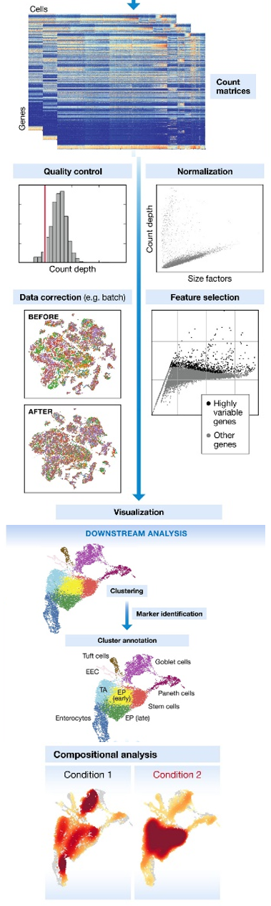
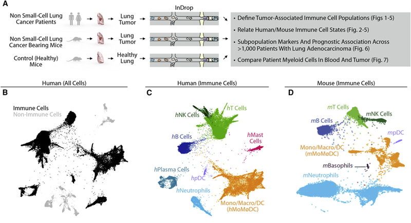

```{r i2dash-global-setup}
# Deal with operation within a switchr environment
if (any(grepl(pattern = ".switchr", x = .libPaths()))) {
  switchr::switchrNoUnload(TRUE)
}

# Make it possible to reuse chunk labels
options(knitr.duplicate.label = "allow")

# Set datadir variable, components should fetch their env from here!
datadir <- "datadir_demo"

# Set up color mappings
colormaps <- list()
```

Introduction {data-navmenu=""}
====================================================

<!-- Page created on 2020-07-02 17:51:04 -->
Inputs {.sidebar data-width=250}
-------------------------------------

### 

<br/>


Column
-------------------------------------
    
### 

**References:**

Rapolas Z. et al. (2019). *Single-Cell Transcriptomics of Human and Mouse Lung Cancers Reveals Conserved Myeloid Populations across Individuals and Species.* Immunity 50, 1317-1334.

**Abstract:**

Tumor-infiltrating myeloid cells (TIMs) comprise monocytes, macrophages, dendritic cells, and neutrophils, and have emerged as key regulators of cancer growth. These cells can diversify into a spectrum of states, which might promote or limit tumor outgrowth but remain poorly understood. Here, we used single-cell RNA sequencing (scRNA-seq) to map TIMs in non-small-cell lung cancer patients. We uncovered 25 TIM states, most of which were reproducibly found across patients. To facilitate translational research of these populations, we also profiled TIMs in mice. In comparing TIMs across species, we identified a near-complete congruence of population structures among dendritic cells and monocytes; conserved neutrophil subsets; and species differences among macrophages. By contrast, myeloid cell population structures in patients' blood showed limited overlap with those of TIMs. This study determines the lung TIM landscape and sets the stage for future investigations into the potential of TIMs as immunotherapy targets.

---

**scRNA-seq of CD45-positive cells from lungs of 2 healthy mice and 2 lung tumor-bearing mice were used.**

Data obtained from [here](https://www.ncbi.nlm.nih.gov/geo/query/acc.cgi?acc=GSE127465)

A sample of the data set with 2000 cells was used for better performance. Full data contained 15939 cells:

```
class: SingleCellExperiment 
dim: 28205 2000 
metadata(0):
assays(1): counts
rownames(28205): 0610007P14Rik 0610009B22Rik ... mt-Nd5 mt-Nd6
rowData names(0):
colnames(2000): bc0517_h_1_1 bc0723_t_1_4 ... bc0010_t_1_4 bc0405_t_2_4
colData names(12): Library Barcode ... Major.cell.type Minor subset
reducedDimNames(1): SPRING
altExpNames(0):
```

 


Column
-------------------------------------
    
### 


<div>

</div>

**Single cell transcriptional profiling of mouse and human immune cells in non-small cell lung cancer**

- **A**. Schematic of experimental workflow for defining and comparing immune transcriptional states in both species. Single cell suspensions for scRNAseq were prepared from patient lung tumor biopsies (n=7), murine lung tumors (n=2), and murine healthy lung tissue (n=2).

- **B**. Two-dimensional visualization (SPRING plots) of immune and non-immune single cell transcriptomes (n= 40,362) in patient lung tumor biopsies (n=7).

- **C, D**. SPRING plots of lung immune cells from (C) human patients (34,450 cells) and (D) mice (15,939 cells). Major cell types were defined by a Bayesian cell classifier using bulk whole-transcriptome profiles of FACS-sorted cell populations.

    

Quality Control {.storyboard data-navmenu=""}
====================================================

<!-- Page created on 2020-07-02 17:51:04 -->

### Total UMI count for each barcode in the dataset, plotted against its rank in decreasing order of total counts (Blue line = inflection; Green line = knee).

<!-- Component created on 2020-07-02 17:48:47 -->

```{r}
if (!requireNamespace("plotly", quietly = TRUE)) {
    stop('The package "plotly" is needed to embed objects of class "plotly".', call. = FALSE)
}

vis_obj_fsmiRq <- readRDS(file.path(datadir, 'obj_fsmiRq.rds'))

# workaround for plotly dependencies issue (https://github.com/ropensci/plotly/issues/1044)
# 
fix_dependency <- function(dependency){
  if(dependency$name == "crosstalk" & dependency$version == "1.1.0"){
    if(dependency$name == "jquery") dependency$src$file <- file.path(system.file(package ="crosstalk"), "lib/jquery")
    if(dependency$name == "crosstalk") dependency$src$file <- file.path(system.file(package ="crosstalk"), "www")
  }
  return(dependency)
}
if ("plotly" == "plotly"){
  vis_obj_fsmiRq$dependencies <- lapply(vis_obj_fsmiRq$dependencies, fix_dependency)  
}

vis_obj_fsmiRq
```


### Ration between detected genes and total count. Each point represents a cell that can be coloured by tissue, library, or biological replicate.

<!-- Component created on 2020-07-02 17:49:03 -->

```{r}
env_adFsR8 <- readRDS(file.path(datadir, "env_adFsR8.rds"))
is_shiny <- identical(knitr::opts_knit$get("rmarkdown.runtime"), "shiny")
library(magrittr)
```

```{r, eval=!is_shiny}
# set variables
if(!is.null(env_adFsR8$x_title)) x_title_env_adFsR8 <- env_adFsR8$x_title else x_title_env_adFsR8 <- colnames(env_adFsR8$x)[1]
if(!is.null(env_adFsR8$y_title)) y_title_env_adFsR8 <- env_adFsR8$y_title else y_title_env_adFsR8 <- colnames(env_adFsR8$y)[1]
if(!is.null(env_adFsR8$colour_by)) colour_by_env_adFsR8 <- env_adFsR8$colour_by[,1] else colour_by_env_adFsR8 <- NULL
if(!is.null(env_adFsR8$labels)) labels_env_adFsR8 <- env_adFsR8$labels else labels_env_adFsR8 <- rownames(env_adFsR8$x)

# compare with colormaps
if(is.factor(colour_by_env_adFsR8)){
  if(colnames(env_adFsR8$colour_by)[1] %in% names(colormaps)) colors_env_adFsR8 <- colormaps[[colnames(env_adFsR8$colour_by)[1]]] else colors_env_adFsR8 <- NULL
} else {
  colors_env_adFsR8 <- NULL
}

# creating the plot object
plot_env_adFsR8 <- i2dash.scrnaseq::plotly_scatterplot(x = env_adFsR8$x[,1], y = env_adFsR8$y[,1], color = colour_by_env_adFsR8, text = labels_env_adFsR8, y_title = y_title_env_adFsR8, x_title = x_title_env_adFsR8, colors = colors_env_adFsR8, type = "scatter") %>%
  plotly::layout(
    title = env_adFsR8$plot_title,
    autosize = F, 
    yaxis = list(automargin = T), 
    xaxis = list(automargin = T)
  ) %>% 
  htmlwidgets::onRender("
                        function(el, x) {
                        // workaround for plotly.js (https://github.com/ropensci/plotly/issues/1546)
                          // get size of parents div container
                          document.getElementById('scatter_env_adFsR8').parentElement.id = 'parent_scatter_env_adFsR8'
                          var clientHeight = document.getElementById('parent_scatter_env_adFsR8').clientHeight;
                          var clientWidth = document.getElementById('parent_scatter_env_adFsR8').clientWidth;
                          
                          // avoid errors at 0 width and height
                          if (clientHeight === 0){
                            clientHeight = 450 // plotly's default value 
                          }
                          if (clientWidth === 0){
                            clientWidth = 700 // plotly's default value 
                          }
                          
                          // get current layout and relayout plotly chart
                          var layout = el.layout;
                          layout.height = clientHeight;
                          layout.width = clientWidth;
  
                          Plotly.relayout(el, layout)
                        }
                        ") %>% 
  plotly::toWebGL()
plot_env_adFsR8$elementId <- "scatter_env_adFsR8" 

# Provide data for download
if(is.null(env_adFsR8$colour_by)){
  df_env_adFsR8 <- data.frame(x = env_adFsR8$x[,1], y = env_adFsR8$y[,1])
} else {
  df_env_adFsR8 <- data.frame(x = env_adFsR8$x[,1], y = env_adFsR8$y[,1], colour_by = env_adFsR8$colour_by[,1])
}
rownames(df_env_adFsR8) <- rownames(env_adFsR8$x)
htmltools::div(style="display:block;float:left;width:100%;height:90%;",
  htmltools::tags$button(i2dash::embed_var(df_env_adFsR8)), plot_env_adFsR8
)
```

```{r, eval=is_shiny}
ui_list <- list()
# selection field for x
if (env_adFsR8$x_selection){
  ui_list <- rlist::list.append(ui_list,
                                selectInput("select_x_env_adFsR8", label = "Select data for x axis:",
                                            choices = colnames(env_adFsR8$x)))
}

# selection field for y
if (env_adFsR8$y_selection){
  ui_list <- rlist::list.append(ui_list,
                                selectInput("select_y_env_adFsR8", label = "Select data for y axis:",
                                            choices = colnames(env_adFsR8$y)))
}
# Radio buttons for colouring
if (length(env_adFsR8$colouring) > 1){
  ui_list <- rlist::list.append(ui_list,
                                radioButtons("radio_env_adFsR8", label = "Select the colouring method:", 
                                                      choices = env_adFsR8$colouring, selected = NULL))
}

# selection field for colour_by_metadata
if (env_adFsR8$colour_by_selection){
  ui_list <- rlist::list.append(ui_list,
                                selectInput("select_colour_env_adFsR8", label = "Select metadata:",
                                            choices = colnames(env_adFsR8$colour_by)))
}

# selection field for colour_by_sample
if (!is.null(env_adFsR8$labels)) {
  ui_list <- rlist::list.append(ui_list,
                                selectInput("select_label_env_adFsR8", label = "Select label:",
                                            choices = env_adFsR8$labels))
}

# selection field for colour_by_feature
if (!is.null(env_adFsR8$exprs_values)) {
  ui_list <- rlist::list.append(ui_list,
                                selectInput("select_feature_env_adFsR8", label = "Select feature:", 
                                            choices = rownames(env_adFsR8$exprs_values)))
}


# Download link
ui_list <- rlist::list.append(ui_list, tags$div(tags$br(), downloadButton('downloadData_env_adFsR8', 'Download data')))

#
# Handle inputs
#
x_env_adFsR8 <- shiny::reactive({
  if(!env_adFsR8$x_selection){
    data <- env_adFsR8$x[[1]]
    title <- colnames(env_adFsR8$x)[1]
    return(list(data = data, title = title))
  } else {
    data <- env_adFsR8$x[[input$select_x_env_adFsR8]]
    title <- input$select_x_env_adFsR8
    return(list(data = data, title = title))
  }
})

y_env_adFsR8 <- shiny::reactive({
  if(!env_adFsR8$y_selection){
    data <- env_adFsR8$y[[1]]
    title <- colnames(env_adFsR8$y)[1]
    return(list(data = data, title = title))
  } else {
    data <- env_adFsR8$y[[input$select_y_env_adFsR8]]
    title <- input$select_y_env_adFsR8
    return(list(data = data, title = title))
  }
})

colour_env_adFsR8 <- shiny::reactive({
  if(length(env_adFsR8$colouring) > 1){
    # "No colour" in radio menu
    if(input$radio_env_adFsR8 == 0){ 
      return(list(colour = NULL, annotation = NULL, colour_title = NULL))
    
    # "Colour by metadata" in radio menu
    } else if(input$radio_env_adFsR8 == 1){
      if(!env_adFsR8$colour_by_selection){
        data <- env_adFsR8$colour_by[[1]]
        title <- colnames(env_adFsR8$colour_by)[1]
      } else {
        data <- env_adFsR8$colour_by[[input$select_colour_env_adFsR8]]
        title <- input$select_colour_env_adFsR8
      }
      return(list(colour = data, annotation = NULL, colour_title = title))
    
    # "Colour by label" in radio menu
    } else if(input$radio_env_adFsR8 == 2){
      point_index <- match(input$select_label_env_adFsR8, env_adFsR8$labels)
      a <- list(
        x = x_env_adFsR8()$data[point_index],
        y = y_env_adFsR8()$data[point_index],
        text = input$select_label_env_adFsR8,
        xref = "x",
        yref = "y",
        showarrow = T,
        arrowhead = 7,
        arrowcolor = "red",
        ax = 20,
        ay = -40
      )
      return(list(colour = NULL, annotation = a, colour_title = NULL))
      
    # "Colour by expression" in radio menu
    } else if(input$radio_env_adFsR8 == 3){
      data <- env_adFsR8$exprs_values[input$select_feature_env_adFsR8,]
      return(list(colour = data, annotation = NULL, colour_title = input$select_feature_env_adFsR8))
    }
  } else {
    return(list(colour = NULL, annotation = NULL, colour_title = NULL))
  }
})

#
# Download data.frame
#
output$downloadData_env_adFsR8 <- downloadHandler(
  filename =  paste('data-', Sys.Date(), '.csv', sep=''),
  content = function(file) {
    if(is.null(colour_env_adFsR8()$colour)){
      df <- data.frame(x = x_env_adFsR8()$data, y = y_env_adFsR8()$data)
    } else {
      df <- data.frame(x = x_env_adFsR8()$data, y = y_env_adFsR8()$data, colour_by = colour_env_adFsR8()$colour)
    }
    if(!is.null(env_adFsR8$labels)) labels <- env_adFsR8$labels else labels <- rownames(env_adFsR8$x)
    rownames(df) <- labels
    write.csv(df, file)
  }
)

#
# reactive plot creation
#
output$plot_env_adFsR8 <- plotly::renderPlotly({
  # compare with colormaps
  if(is.factor(colour_env_adFsR8()$colour)){
    if(colour_env_adFsR8()$colour_title %in% names(colormaps)) colors <- colormaps[[colour_env_adFsR8()$colour_title]] else colors <- "Set1"
  } else {
    colors <- NULL
  }

  if(!is.null(env_adFsR8$y_title)) y_title <- env_adFsR8$y_title else y_title <- y_env_adFsR8()$title
  if(!is.null(env_adFsR8$x_title)) x_title <- env_adFsR8$x_title else x_title <- x_env_adFsR8()$title
  if(!is.null(env_adFsR8$labels)) labels <- env_adFsR8$labels else labels <- rownames(env_adFsR8$x)
  
  i2dash.scrnaseq::plotly_scatterplot(x = x_env_adFsR8()$data, y = y_env_adFsR8()$data, color = colour_env_adFsR8()$colour, text = labels, y_title = y_title, x_title = x_title, colors = colors, type = "scatter") %>%
    plotly::layout(
      annotations = colour_env_adFsR8()$annotation,
      title = env_adFsR8$plot_title
    ) %>% plotly::toWebGL()
})

#
# Layout of component
#
shiny::fillRow(flex = c(NA, 1),
      shinyWidgets::dropdownButton(div(style='max-height: 350px; overflow-x: auto;',do.call(shiny::inputPanel, ui_list)),
                       circle = TRUE, status = "danger", icon = icon("gear"), width = "300px",
                       tooltip = shinyWidgets::tooltipOptions(title = "Click, to change plot settings:")),
      renderUI({plotly::plotlyOutput("plot_env_adFsR8", height = "100%")})
)
```


### Key quality metrics (total counts per cell, proportion of mitochondrial reads, number of detected features) grouped by condition.

<!-- Component created on 2020-07-02 17:49:19 -->

```{r}
env_kb0GsU <- readRDS(file.path(datadir, "env_kb0GsU.rds"))
is_shiny <- identical(knitr::opts_knit$get("rmarkdown.runtime"), "shiny")
library(magrittr)
```

```{r, eval=!is_shiny}
# selecting the first numeric and factor column for object wrapper 
env_kb0GsU$y %>%
  as.data.frame() %>%
  dplyr::select_if(function(col) is.integer(col) | is.numeric(col)) %>%
  dplyr::select(1) -> y_env_kb0GsU

if(!is.null(env_kb0GsU$group_by)){
  env_kb0GsU$group_by %>%
    as.data.frame() %>%
    dplyr::select_if(is.factor) %>%
    dplyr::select(1) -> group_by_env_kb0GsU
  group_by_title_env_kb0GsU <- colnames(group_by_env_kb0GsU)
} else {
  group_by_title_env_kb0GsU <- NULL
  group_by_env_kb0GsU <- NULL
}

# compare with colormaps
if(!is.null(group_by_title_env_kb0GsU)){
  if(group_by_title_env_kb0GsU %in% names(colormaps)) colors_env_kb0GsU <- colormaps[[group_by_title_env_kb0GsU]] else colors_env_kb0GsU <- "Set1"
} else {
  colors_env_kb0GsU <- "Set1"
}

# set title variables
if(!is.null(env_kb0GsU$y_title)) y_title_env_kb0GsU <- env_kb0GsU$y_title else y_title_env_kb0GsU <- colnames(y_env_kb0GsU)
if(!is.null(env_kb0GsU$group_by_title)) group_by_title_env_kb0GsU <- env_kb0GsU$group_by_title

# creating the plot object
plot_env_kb0GsU <- i2dash.scrnaseq::plotly_violinplot(y = y_env_kb0GsU[,1], group_by = group_by_env_kb0GsU[,1], y_title = y_title_env_kb0GsU, group_by_title = group_by_title_env_kb0GsU, colors = colors_env_kb0GsU)

# Provide data for download
if(!is.null(env_kb0GsU$group_by)) download_df_env_kb0GsU <- data.frame(y_env_kb0GsU, group_by_env_kb0GsU) else download_df_env_kb0GsU <- data.frame(y_env_kb0GsU)
rownames(download_df_env_kb0GsU) <- rownames(env_kb0GsU$y)
htmltools::div(style="display:block;float:left;width:100%;height:90%;",
  htmltools::tags$button(i2dash::embed_var(download_df_env_kb0GsU)), plot_env_kb0GsU
)
```

```{r, eval=is_shiny}
ui_list <- list()

#
# shiny input widget for y
#
if (env_kb0GsU$y_selection){
  ui_list <- rlist::list.append(ui_list,
                                selectInput("select_y_env_kb0GsU", label = "Select observations:",
                                            choices = colnames(env_kb0GsU$y[lapply(env_kb0GsU$y,class) =="numeric" | lapply(env_kb0GsU$y,class) =="integer"])))
}

#
# shiny input widget for group_by
#
if (env_kb0GsU$group_by_selection){
  ui_list <- rlist::list.append(ui_list,
                                selectInput("select_group_by_env_kb0GsU", label = "Group observations by:",
                                            choices = colnames(env_kb0GsU$group_by[lapply(env_kb0GsU$group_by,class) =="factor"])))
}
#
# shiny download button
#
ui_list <- rlist::list.append(ui_list, tags$div(tags$br(), downloadButton('downloadData_env_kb0GsU', 'Download data')))

#
# Handle inputs
#
if( !env_kb0GsU$y_selection){
  y_env_kb0GsU <- shiny::reactive({
    data <- env_kb0GsU$y[[1]]
    title <- colnames(env_kb0GsU$y)[1]
    return(list(data = data, title = title))
  })
} else {
  y_env_kb0GsU <- shiny::reactive({
    data <- env_kb0GsU$y[[input$select_y_env_kb0GsU]]
    title <- input$select_y_env_kb0GsU
    return(list(data = data, title = title))
  })
}

if( !env_kb0GsU$group_by_selection ) {
  group_by_env_kb0GsU <- shiny::reactive({
    data <- env_kb0GsU$group_by[[1]]
    title <- colnames(env_kb0GsU$group_by)[1]
    return(list(data = data, title = title))
  })
} else {
  group_by_env_kb0GsU <- shiny::reactive({
    data <- env_kb0GsU$group_by[[input$select_group_by_env_kb0GsU]]
    title <- input$select_group_by_env_kb0GsU
    return(list(data = data, title = title))
  })
}

#
# Download data.frame
#
output$downloadData_env_kb0GsU <- downloadHandler(
  filename =  paste('data-', Sys.Date(), '.csv', sep=''),
  content = function(file) {
    if(is.null(env_kb0GsU$group_by)){
      df <- y_env_kb0GsU()$data
    } else {
      df <- data.frame(y_env_kb0GsU()$data, group_by_env_kb0GsU()$data)
    }
    rownames(df) <- rownames(env_kb0GsU$y)
    write.csv(df, file)
    
  }
)

#
# reactive for plot creation
#
output$plot_env_kb0GsU <- plotly::renderPlotly({
  # compare with colormaps
  if(!is.null(group_by_env_kb0GsU()$title)){
    if(group_by_env_kb0GsU()$title %in% names(colormaps)) colors <- colormaps[[group_by_env_kb0GsU()$title]] else colors <- "Set1"
  } else {
    colors <- "Set1"
  }
  
  # set custom axis titles if provided
  if(!is.null(env_kb0GsU$y_title)) y_title <- env_kb0GsU$y_title else y_title <- y_env_kb0GsU()$title
  if(!is.null(env_kb0GsU$group_by_title)) group_by_title <- env_kb0GsU$group_by_title else group_by_title <- group_by_env_kb0GsU()$title
  
  i2dash.scrnaseq::plotly_violinplot(y = y_env_kb0GsU()$data, group_by = group_by_env_kb0GsU()$data, y_title = y_title, group_by_title = group_by_title, colors = colors)
})

#
# Layout of component
#
shiny::fillRow(flex = c(NA, 1),
      shinyWidgets::dropdownButton(div(style='max-height: 350px; overflow-x: auto;',do.call(shiny::inputPanel, ui_list)),
                       circle = TRUE, status = "danger", icon = icon("gear"), width = "300px",
                       tooltip = shinyWidgets::tooltipOptions(title = "Click, to change plot settings:")),
      plotly::plotlyOutput("plot_env_kb0GsU", height = "100%")
)
```

### Scatterplot of reads mapped to mitochondrial transcripts (%) against detected genes, coloured by discarded cells (red). Each point represents a cell.

<!-- Component created on 2020-07-02 17:49:19 -->

```{r}
if (!requireNamespace("plotly", quietly = TRUE)) {
    stop('The package "plotly" is needed to embed objects of class "plotly".', call. = FALSE)
}

vis_obj_VWIjEV <- readRDS(file.path(datadir, 'obj_VWIjEV.rds'))

# workaround for plotly dependencies issue (https://github.com/ropensci/plotly/issues/1044)
# 
fix_dependency <- function(dependency){
  if(dependency$name == "crosstalk" & dependency$version == "1.1.0"){
    if(dependency$name == "jquery") dependency$src$file <- file.path(system.file(package ="crosstalk"), "lib/jquery")
    if(dependency$name == "crosstalk") dependency$src$file <- file.path(system.file(package ="crosstalk"), "www")
  }
  return(dependency)
}
if ("plotly" == "plotly"){
  vis_obj_VWIjEV$dependencies <- lapply(vis_obj_VWIjEV$dependencies, fix_dependency)  
}

vis_obj_VWIjEV
```


Summary {data-navmenu=""}
====================================================

<!-- Page created on 2020-07-02 17:51:04 -->


Column
-------------------------------------
    

### Metadata statistic

<!-- Component created on 2020-07-02 17:49:35 -->

```{r}
env_SzLhgd <- readRDS(file.path(datadir, "env_SzLhgd.rds"))
library(magrittr)
```

```{r}
# selecting the first numeric and factor column for object wrapper 
env_SzLhgd$df %>%
  kableExtra::kable() %>%
  kableExtra::kable_styling(bootstrap_options = c("striped", "hover")) %>%
  kableExtra::footnote(general = env_SzLhgd$footnote_text,
                       general_title = env_SzLhgd$footnote_title,
                       footnote_as_chunk = T,
                       title_format = c("bold", "underline")) -> env_SzLhgd_kable

# prepare a header vector for kableExtra::add_header_above
if(!is.null(env_SzLhgd$group_by)){
  env_SzLhgd_level_nr <- length(unique(env_SzLhgd$group_by))
  env_SzLhgd_FUNS_nr <- length(env_SzLhgd$FUNS)
  env_SzLhgd_header_vector <- c(1, rep(env_SzLhgd_level_nr, env_SzLhgd_FUNS_nr))
  names(env_SzLhgd_header_vector) <- c(" ", env_SzLhgd$FUNS)
  env_SzLhgd_kable %<>%
    kableExtra::add_header_above(env_SzLhgd_header_vector)
}

# Provide data for download
env_SzLhgd_df <- env_SzLhgd$df
if(!is.null(env_SzLhgd$group_by)){
  fun_vector <- unlist(lapply(env_SzLhgd$FUNS, rep, times = length(unique(env_SzLhgd$group_by))))
  colnames(env_SzLhgd_df) <- paste0(colnames(env_SzLhgd_df),"_", fun_vector)
}
env_SzLhgd_kable
htmltools::tags$button(i2dash::embed_var(env_SzLhgd_df)) 
```


 


Column
-------------------------------------
    
### Cell filtering

<!-- Component created on 2020-07-02 17:49:35 -->

```{r}
if (!requireNamespace("kableExtra", quietly = TRUE)) {
    stop('The package "kableExtra" is needed to embed objects of class "kableExtra".', call. = FALSE)
}

vis_obj_v70c9A <- readRDS(file.path(datadir, 'obj_v70c9A.rds'))

# workaround for plotly dependencies issue (https://github.com/ropensci/plotly/issues/1044)
# 
fix_dependency <- function(dependency){
  if(dependency$name == "crosstalk" & dependency$version == "1.1.0"){
    if(dependency$name == "jquery") dependency$src$file <- file.path(system.file(package ="crosstalk"), "lib/jquery")
    if(dependency$name == "crosstalk") dependency$src$file <- file.path(system.file(package ="crosstalk"), "www")
  }
  return(dependency)
}
if ("kableExtra" == "plotly"){
  vis_obj_v70c9A$dependencies <- lapply(vis_obj_v70c9A$dependencies, fix_dependency)  
}

vis_obj_v70c9A
```


    

Cell metadata 1 {data-navmenu="Cell metadata"}
====================================================

<!-- Page created on 2020-07-02 17:51:04 -->


Column
-------------------------------------
    

### Dimension reduction:

<!-- Component created on 2020-07-02 17:49:50 -->

```{r}
env_uZD4GZ <- readRDS(file.path(datadir, "env_uZD4GZ.rds"))
is_shiny <- identical(knitr::opts_knit$get("rmarkdown.runtime"), "shiny")

library(dplyr)

labels_env_uZD4GZ <- env_uZD4GZ$labels
metadata_env_uZD4GZ <- env_uZD4GZ$metadata
grouping_env_uZD4GZ <- env_uZD4GZ$grouping

# function to create a data.frame
create_df <- function(reduced_dim, metadata, grouping){
  
  # Create data.frame for linked plots
  # 1 Create df1 
  df1 <- data.frame("x" = reduced_dim[,1], "y" = reduced_dim[,2], metadata)
  
  # 2 create silhouette object
  sil <- cluster::silhouette(as.integer(metadata[[grouping]]), dist(reduced_dim))
  
  # 3 create df2 for silhoutte
  df2 <- data.frame(cell = factor(rownames(reduced_dim), levels = rownames(reduced_dim)), silhouette = sil[,"sil_width"], cluster = factor(sil[,"cluster"], levels = unique(as.numeric(metadata[[grouping]])[order(as.numeric(metadata[[grouping]]))]), ordered = T))
  df2$cell <- factor(df2$cell, levels = df2$cell[order(df2$cluster, df2$silhouette)])
  
  # 4 sort df1 according to the cell column of df2
  # combine both data.frames in df3
  df3 <- df1[order(match(rownames(df1), df2["cell"])),]
  df3$cell <- df2$cell
  df3$silhouette <- df2$silhouette
  
  row.names(df3) <- c()
  
  return(df3)
}
```

```{r, eval=!is_shiny}
df_env_uZD4GZ <- create_df(reduced_dim = env_uZD4GZ$reduced_dim, metadata = metadata_env_uZD4GZ, grouping = grouping_env_uZD4GZ)

sd_env_uZD4GZ <- plotly::highlight_key(df_env_uZD4GZ)

# compare with colormaps
if(grouping_env_uZD4GZ %in% names(colormaps)) colors_env_uZD4GZ <- colormaps[[grouping_env_uZD4GZ]] else colors_env_uZD4GZ <- "Set1"

dots <- plotly::plot_ly(sd_env_uZD4GZ, colors = colors_env_uZD4GZ, color = df_env_uZD4GZ[[grouping_env_uZD4GZ]], x = ~x, y = ~y, mode = "markers", textposition = "top", hoverinfo = "x+y+text", text = paste("grouping: ", df_env_uZD4GZ[[grouping_env_uZD4GZ]], "</br> label: ", labels_env_uZD4GZ), type = "scattergl") %>%
  plotly::layout(
    xaxis = list(title = "Dimension 1"),
    yaxis = list(title = "Dimension 2"),
    showlegend = FALSE
  ) %>%
  plotly::highlight("plotly_selected") %>%
  plotly::toWebGL()

htmltools::div(style="display:block;float:left;width:100%;height:90%;",
  htmltools::tags$button(i2dash::embed_var(df_env_uZD4GZ)), dots
)
```

```{r, eval=is_shiny}
# filter all factorial metadata columns
factors_env_uZD4GZ <- c()
for (name in colnames(metadata_env_uZD4GZ)){
  if(is.factor(metadata_env_uZD4GZ[[name]])){
    factors_env_uZD4GZ <- c(factors_env_uZD4GZ, name)
  }
}
ui_list <- list()

# selection field for x
if (env_uZD4GZ$multiple_meta){
  ui_list <- rlist::list.append(ui_list,
                                selectInput("select_grouping_env_uZD4GZ", label = "Select column for grouping:",
                                            choices = factors_env_uZD4GZ, selected = grouping_env_uZD4GZ))
}

# Download link
ui_list <- rlist::list.append(ui_list, tags$div(tags$br(), downloadButton('downloadData_env_uZD4GZ', 'Download data')))

#
# Create reactive data table
#
df_env_uZD4GZ <- shiny::reactive({
  if (!env_uZD4GZ$multiple_meta){
    grouping <- grouping_env_uZD4GZ
  } else {
    grouping <- input$select_grouping_env_uZD4GZ
  }
  df_env_uZD4GZ <- create_df(reduced_dim = env_uZD4GZ$reduced_dim, metadata = metadata_env_uZD4GZ, grouping = grouping)

  sd_env_uZD4GZ <- plotly::highlight_key(df_env_uZD4GZ)
  return(list("sd" = sd_env_uZD4GZ, "df" = df_env_uZD4GZ, "grouping" = grouping))
})

#
# Download
#
output$downloadData_env_uZD4GZ<- downloadHandler(
  filename =  paste('data-', Sys.Date(), '.csv', sep=''),
  content = function(file) {
    write.csv(df_env_uZD4GZ()$df, file)
  }
)

#
# Output
#
output$plot_scatter_env_uZD4GZ <- plotly::renderPlotly({
  # compare with colormaps
  if(df_env_uZD4GZ()$grouping %in% names(colormaps)) colors <- colormaps[[df_env_uZD4GZ()$grouping]] else colors <- "Set1"
  
  dots <- plotly::plot_ly(df_env_uZD4GZ()$sd, color = df_env_uZD4GZ()$df[[df_env_uZD4GZ()$grouping]], x = ~x, y = ~y, mode = "markers", textposition = "top", hoverinfo = "x+y+text", text = paste("grouping: ", df_env_uZD4GZ()$df[[df_env_uZD4GZ()$grouping]], "</br> label: ", labels_env_uZD4GZ),  type = "scattergl", colors = colors) %>%
  plotly::layout(
    xaxis = list(title = "Dimension 1"),
    yaxis = list(title = "Dimension 2"),
    showlegend = FALSE
  ) %>%
    plotly::highlight("plotly_selected") %>% 
    plotly::toWebGL()
  dots
})

#
# Layout of component
#
shiny::fillRow(flex = c(NA, 1),
      shinyWidgets::dropdownButton(div(style='max-height: 350px; overflow-x: auto;',do.call(shiny::inputPanel, ui_list)),
                       circle = TRUE, status = "danger", icon = icon("gear"), width = "300px",
                       tooltip = shinyWidgets::tooltipOptions(title = "Click, to change plot settings:")),
      renderUI({plotly::plotlyOutput("plot_scatter_env_uZD4GZ", height = "100%")})
)
```


 

### Silhouette plot

<!-- Component created on 2020-07-02 17:49:50 -->

```{r, eval=!is_shiny}
# Handle colormaps
if(grouping_env_uZD4GZ %in% names(colormaps)) colors_env_uZD4GZ <- colormaps[[grouping_env_uZD4GZ]] else colors_env_uZD4GZ <- "Set1"

sil_plot <- plotly::plot_ly(sd_env_uZD4GZ, colors = colors_env_uZD4GZ) %>%
  plotly::add_bars(color = df_env_uZD4GZ[[grouping_env_uZD4GZ]], name = df_env_uZD4GZ[[grouping_env_uZD4GZ]], orientation = 'h', y = ~cell, x = ~silhouette) %>%
  plotly::layout(yaxis = list(showticklabels = FALSE), showlegend = FALSE) %>%
  plotly::highlight(on = "plotly_selected", dynamic = F, selectize = F)
sil_plot
```

```{r, eval=is_shiny}
#
# Output
#
output$plot_sil_env_uZD4GZ <- plotly::renderPlotly({
  # Handle colormaps
  if(df_env_uZD4GZ()$grouping %in% names(colormaps)) colors <- colormaps[[df_env_uZD4GZ()$grouping]] else colors <- "Set1"
  
  sil_plot <- plotly::plot_ly(df_env_uZD4GZ()$sd, colors = colors) %>%
  plotly::add_bars(color = df_env_uZD4GZ()$df[[df_env_uZD4GZ()$grouping]], name = df_env_uZD4GZ()$df[[df_env_uZD4GZ()$grouping]], orientation = 'h', y = ~cell, x = ~silhouette) %>%
  plotly::layout(yaxis = list(showticklabels = FALSE), showlegend = FALSE) %>%
  plotly::highlight(on = "plotly_selected", dynamic = F, selectize = F)
  sil_plot
})

#
# Layout of component
#
renderUI({plotly::plotlyOutput("plot_sil_env_uZD4GZ", height = "100%")})
```


Column
-------------------------------------
    

### Number of observations per grouing

<!-- Component created on 2020-07-02 17:49:50 -->

```{r, eval=!is_shiny}
if(grouping_env_uZD4GZ %in% names(colormaps)) colors_env_uZD4GZ <- colormaps[[grouping_env_uZD4GZ]] else colors_env_uZD4GZ <- "Set1"
sp_bars <- plotly::plot_ly(sd_env_uZD4GZ, colors = colors_env_uZD4GZ, x = df_env_uZD4GZ[[grouping_env_uZD4GZ]], color = df_env_uZD4GZ[[grouping_env_uZD4GZ]]) %>%
  plotly::layout(
    xaxis = list(title = names(df_env_uZD4GZ[grouping_env_uZD4GZ])),
    yaxis = list(title = "Number of observations"),
    barmode = "overlay",
    showlegend = FALSE
  ) %>%
  plotly::highlight("plotly_selected")
sp_bars
```

```{r, eval=is_shiny}
#
# Output
#
output$plot_sp_bars_env_uZD4GZ <- plotly::renderPlotly({
  if(df_env_uZD4GZ()$grouping %in% names(colormaps)) colors <- colormaps[[df_env_uZD4GZ()$grouping]] else colors <- "Set1"
  sp_bars <- plotly::plot_ly(df_env_uZD4GZ()$sd, colors = colors, x = df_env_uZD4GZ()$df[[df_env_uZD4GZ()$grouping]], color = df_env_uZD4GZ()$df[[df_env_uZD4GZ()$grouping]]) %>%
  plotly::layout(
    xaxis = list(title = names(df_env_uZD4GZ()$df[df_env_uZD4GZ()$grouping])),
    yaxis = list(title = "Number of observations"),
    barmode = "overlay",
    showlegend = FALSE
  ) %>%
  plotly::highlight("plotly_selected")
  sp_bars
})

#
# Layout of component
#
renderUI({plotly::plotlyOutput("plot_sp_bars_env_uZD4GZ", height = "100%")})
```


    
### Metadata: subsets_Mito_percent

<!-- Component created on 2020-07-02 17:49:50 -->

```{r, eval=!is_shiny}
if(is.factor(df_env_uZD4GZ[["subsets_Mito_percent"]])){
  if("subsets_Mito_percent" %in% names(colormaps)) colors_env_uZD4GZ <- colormaps[["subsets_Mito_percent"]] else colors_env_uZD4GZ <- "Set1"
  bars_subsets_Mito_percent <- plotly::plot_ly(sd_env_uZD4GZ, colors = colors_env_uZD4GZ, x = df_env_uZD4GZ[["subsets_Mito_percent"]], color = df_env_uZD4GZ[["subsets_Mito_percent"]]) %>%
  plotly::layout(
    xaxis = list(title = names(df_env_uZD4GZ["subsets_Mito_percent"])),
    yaxis = list(title = "Number of observations"),
    barmode = "overlay",
    showlegend = FALSE
  ) %>%
  plotly::highlight("plotly_selected")
  bars_subsets_Mito_percent
} else {
  if(grouping_env_uZD4GZ %in% names(colormaps)) colors_env_uZD4GZ <- colormaps[[grouping_env_uZD4GZ]] else colors_env_uZD4GZ <- "Set1"
  box_subsets_Mito_percent <- plotly::plot_ly(sd_env_uZD4GZ, colors = colors_env_uZD4GZ, x = df_env_uZD4GZ[[grouping_env_uZD4GZ]], y = df_env_uZD4GZ[["subsets_Mito_percent"]], color = df_env_uZD4GZ[[grouping_env_uZD4GZ]]) %>%
  plotly::add_boxplot() %>%
  plotly::layout(
    xaxis = list(title = grouping_env_uZD4GZ),
    yaxis = list(title = names(df_env_uZD4GZ["subsets_Mito_percent"])),
    showlegend = FALSE
  ) %>%
  plotly::highlight("plotly_selected")
  box_subsets_Mito_percent
}
```

```{r, eval=is_shiny}
#
# Output
#
output$plot_box_bar_subsets_Mito_percent_env_uZD4GZ <- plotly::renderPlotly({
  if(is.factor(df_env_uZD4GZ()$df[["subsets_Mito_percent"]])){
    if("subsets_Mito_percent" %in% names(colormaps)) colors <- colormaps[["subsets_Mito_percent"]] else colors <- "Set1"
    bars <- plotly::plot_ly(df_env_uZD4GZ()$sd, colors = colors, x = df_env_uZD4GZ()$df[["subsets_Mito_percent"]], color = df_env_uZD4GZ()$df[["subsets_Mito_percent"]]) %>%
    plotly::layout(
      xaxis = list(title = names(df_env_uZD4GZ()$df["subsets_Mito_percent"])),
      yaxis = list(title = "Number of observations"),
      barmode = "overlay",
      showlegend = FALSE
    ) %>%
    plotly::highlight("plotly_selected")
    bars
  } else {
    if(df_env_uZD4GZ()$grouping %in% names(colormaps)) colors <- colormaps[[df_env_uZD4GZ()$grouping]] else colors <- "Set1"
    box <- plotly::plot_ly(df_env_uZD4GZ()$sd, colors = colors, x = df_env_uZD4GZ()$df[[df_env_uZD4GZ()$grouping]], y = df_env_uZD4GZ()$df[["subsets_Mito_percent"]], color = df_env_uZD4GZ()$df[[df_env_uZD4GZ()$grouping]]) %>%
    plotly::add_boxplot() %>%
    plotly::layout(
      xaxis = list(title = df_env_uZD4GZ()$grouping),
      yaxis = list(title = names(df_env_uZD4GZ()$df["subsets_Mito_percent"])),
      showlegend = FALSE
    ) %>%
    plotly::highlight("plotly_selected")
    box
  }
})

#
# Layout of component
#
renderUI({plotly::plotlyOutput("plot_box_bar_subsets_Mito_percent_env_uZD4GZ", height = "100%")})
```


Cell metadata 2 {data-navmenu="Cell metadata"}
====================================================

<!-- Page created on 2020-07-02 17:51:04 -->


Column
-------------------------------------
    

### Dimension reduction:

<!-- Component created on 2020-07-02 17:50:03 -->

```{r}
env_xyQR5H <- readRDS(file.path(datadir, "env_xyQR5H.rds"))
is_shiny <- identical(knitr::opts_knit$get("rmarkdown.runtime"), "shiny")

library(dplyr)

labels_env_xyQR5H <- env_xyQR5H$labels
metadata_env_xyQR5H <- env_xyQR5H$metadata
grouping_env_xyQR5H <- env_xyQR5H$grouping

# function to create a data.frame
create_df <- function(reduced_dim, metadata, grouping){
  
  # Create data.frame for linked plots
  # 1 Create df1 
  df1 <- data.frame("x" = reduced_dim[,1], "y" = reduced_dim[,2], metadata)
  
  # 2 create silhouette object
  sil <- cluster::silhouette(as.integer(metadata[[grouping]]), dist(reduced_dim))
  
  # 3 create df2 for silhoutte
  df2 <- data.frame(cell = factor(rownames(reduced_dim), levels = rownames(reduced_dim)), silhouette = sil[,"sil_width"], cluster = factor(sil[,"cluster"], levels = unique(as.numeric(metadata[[grouping]])[order(as.numeric(metadata[[grouping]]))]), ordered = T))
  df2$cell <- factor(df2$cell, levels = df2$cell[order(df2$cluster, df2$silhouette)])
  
  # 4 sort df1 according to the cell column of df2
  # combine both data.frames in df3
  df3 <- df1[order(match(rownames(df1), df2["cell"])),]
  df3$cell <- df2$cell
  df3$silhouette <- df2$silhouette
  
  row.names(df3) <- c()
  
  return(df3)
}
```

```{r, eval=!is_shiny}
df_env_xyQR5H <- create_df(reduced_dim = env_xyQR5H$reduced_dim, metadata = metadata_env_xyQR5H, grouping = grouping_env_xyQR5H)

sd_env_xyQR5H <- plotly::highlight_key(df_env_xyQR5H)

# compare with colormaps
if(grouping_env_xyQR5H %in% names(colormaps)) colors_env_xyQR5H <- colormaps[[grouping_env_xyQR5H]] else colors_env_xyQR5H <- "Set1"

dots <- plotly::plot_ly(sd_env_xyQR5H, colors = colors_env_xyQR5H, color = df_env_xyQR5H[[grouping_env_xyQR5H]], x = ~x, y = ~y, mode = "markers", textposition = "top", hoverinfo = "x+y+text", text = paste("grouping: ", df_env_xyQR5H[[grouping_env_xyQR5H]], "</br> label: ", labels_env_xyQR5H), type = "scattergl") %>%
  plotly::layout(
    xaxis = list(title = "Dimension 1"),
    yaxis = list(title = "Dimension 2"),
    showlegend = FALSE
  ) %>%
  plotly::highlight("plotly_selected") %>%
  plotly::toWebGL()

htmltools::div(style="display:block;float:left;width:100%;height:90%;",
  htmltools::tags$button(i2dash::embed_var(df_env_xyQR5H)), dots
)
```

```{r, eval=is_shiny}
# filter all factorial metadata columns
factors_env_xyQR5H <- c()
for (name in colnames(metadata_env_xyQR5H)){
  if(is.factor(metadata_env_xyQR5H[[name]])){
    factors_env_xyQR5H <- c(factors_env_xyQR5H, name)
  }
}
ui_list <- list()

# selection field for x
if (env_xyQR5H$multiple_meta){
  ui_list <- rlist::list.append(ui_list,
                                selectInput("select_grouping_env_xyQR5H", label = "Select column for grouping:",
                                            choices = factors_env_xyQR5H, selected = grouping_env_xyQR5H))
}

# Download link
ui_list <- rlist::list.append(ui_list, tags$div(tags$br(), downloadButton('downloadData_env_xyQR5H', 'Download data')))

#
# Create reactive data table
#
df_env_xyQR5H <- shiny::reactive({
  if (!env_xyQR5H$multiple_meta){
    grouping <- grouping_env_xyQR5H
  } else {
    grouping <- input$select_grouping_env_xyQR5H
  }
  df_env_xyQR5H <- create_df(reduced_dim = env_xyQR5H$reduced_dim, metadata = metadata_env_xyQR5H, grouping = grouping)

  sd_env_xyQR5H <- plotly::highlight_key(df_env_xyQR5H)
  return(list("sd" = sd_env_xyQR5H, "df" = df_env_xyQR5H, "grouping" = grouping))
})

#
# Download
#
output$downloadData_env_xyQR5H<- downloadHandler(
  filename =  paste('data-', Sys.Date(), '.csv', sep=''),
  content = function(file) {
    write.csv(df_env_xyQR5H()$df, file)
  }
)

#
# Output
#
output$plot_scatter_env_xyQR5H <- plotly::renderPlotly({
  # compare with colormaps
  if(df_env_xyQR5H()$grouping %in% names(colormaps)) colors <- colormaps[[df_env_xyQR5H()$grouping]] else colors <- "Set1"
  
  dots <- plotly::plot_ly(df_env_xyQR5H()$sd, color = df_env_xyQR5H()$df[[df_env_xyQR5H()$grouping]], x = ~x, y = ~y, mode = "markers", textposition = "top", hoverinfo = "x+y+text", text = paste("grouping: ", df_env_xyQR5H()$df[[df_env_xyQR5H()$grouping]], "</br> label: ", labels_env_xyQR5H),  type = "scattergl", colors = colors) %>%
  plotly::layout(
    xaxis = list(title = "Dimension 1"),
    yaxis = list(title = "Dimension 2"),
    showlegend = FALSE
  ) %>%
    plotly::highlight("plotly_selected") %>% 
    plotly::toWebGL()
  dots
})

#
# Layout of component
#
shiny::fillRow(flex = c(NA, 1),
      shinyWidgets::dropdownButton(div(style='max-height: 350px; overflow-x: auto;',do.call(shiny::inputPanel, ui_list)),
                       circle = TRUE, status = "danger", icon = icon("gear"), width = "300px",
                       tooltip = shinyWidgets::tooltipOptions(title = "Click, to change plot settings:")),
      renderUI({plotly::plotlyOutput("plot_scatter_env_xyQR5H", height = "100%")})
)
```


 
### Metadata: sum

<!-- Component created on 2020-07-02 17:50:03 -->

```{r, eval=!is_shiny}
if(is.factor(df_env_xyQR5H[["sum"]])){
  if("sum" %in% names(colormaps)) colors_env_xyQR5H <- colormaps[["sum"]] else colors_env_xyQR5H <- "Set1"
  bars_sum <- plotly::plot_ly(sd_env_xyQR5H, colors = colors_env_xyQR5H, x = df_env_xyQR5H[["sum"]], color = df_env_xyQR5H[["sum"]]) %>%
  plotly::layout(
    xaxis = list(title = names(df_env_xyQR5H["sum"])),
    yaxis = list(title = "Number of observations"),
    barmode = "overlay",
    showlegend = FALSE
  ) %>%
  plotly::highlight("plotly_selected")
  bars_sum
} else {
  if(grouping_env_xyQR5H %in% names(colormaps)) colors_env_xyQR5H <- colormaps[[grouping_env_xyQR5H]] else colors_env_xyQR5H <- "Set1"
  box_sum <- plotly::plot_ly(sd_env_xyQR5H, colors = colors_env_xyQR5H, x = df_env_xyQR5H[[grouping_env_xyQR5H]], y = df_env_xyQR5H[["sum"]], color = df_env_xyQR5H[[grouping_env_xyQR5H]]) %>%
  plotly::add_boxplot() %>%
  plotly::layout(
    xaxis = list(title = grouping_env_xyQR5H),
    yaxis = list(title = names(df_env_xyQR5H["sum"])),
    showlegend = FALSE
  ) %>%
  plotly::highlight("plotly_selected")
  box_sum
}
```

```{r, eval=is_shiny}
#
# Output
#
output$plot_box_bar_sum_env_xyQR5H <- plotly::renderPlotly({
  if(is.factor(df_env_xyQR5H()$df[["sum"]])){
    if("sum" %in% names(colormaps)) colors <- colormaps[["sum"]] else colors <- "Set1"
    bars <- plotly::plot_ly(df_env_xyQR5H()$sd, colors = colors, x = df_env_xyQR5H()$df[["sum"]], color = df_env_xyQR5H()$df[["sum"]]) %>%
    plotly::layout(
      xaxis = list(title = names(df_env_xyQR5H()$df["sum"])),
      yaxis = list(title = "Number of observations"),
      barmode = "overlay",
      showlegend = FALSE
    ) %>%
    plotly::highlight("plotly_selected")
    bars
  } else {
    if(df_env_xyQR5H()$grouping %in% names(colormaps)) colors <- colormaps[[df_env_xyQR5H()$grouping]] else colors <- "Set1"
    box <- plotly::plot_ly(df_env_xyQR5H()$sd, colors = colors, x = df_env_xyQR5H()$df[[df_env_xyQR5H()$grouping]], y = df_env_xyQR5H()$df[["sum"]], color = df_env_xyQR5H()$df[[df_env_xyQR5H()$grouping]]) %>%
    plotly::add_boxplot() %>%
    plotly::layout(
      xaxis = list(title = df_env_xyQR5H()$grouping),
      yaxis = list(title = names(df_env_xyQR5H()$df["sum"])),
      showlegend = FALSE
    ) %>%
    plotly::highlight("plotly_selected")
    box
  }
})

#
# Layout of component
#
renderUI({plotly::plotlyOutput("plot_box_bar_sum_env_xyQR5H", height = "100%")})
```


Column
-------------------------------------
    
### Metadata: Tissue

<!-- Component created on 2020-07-02 17:50:03 -->

```{r, eval=!is_shiny}
if(is.factor(df_env_xyQR5H[["Tissue"]])){
  if("Tissue" %in% names(colormaps)) colors_env_xyQR5H <- colormaps[["Tissue"]] else colors_env_xyQR5H <- "Set1"
  bars_Tissue <- plotly::plot_ly(sd_env_xyQR5H, colors = colors_env_xyQR5H, x = df_env_xyQR5H[["Tissue"]], color = df_env_xyQR5H[["Tissue"]]) %>%
  plotly::layout(
    xaxis = list(title = names(df_env_xyQR5H["Tissue"])),
    yaxis = list(title = "Number of observations"),
    barmode = "overlay",
    showlegend = FALSE
  ) %>%
  plotly::highlight("plotly_selected")
  bars_Tissue
} else {
  if(grouping_env_xyQR5H %in% names(colormaps)) colors_env_xyQR5H <- colormaps[[grouping_env_xyQR5H]] else colors_env_xyQR5H <- "Set1"
  box_Tissue <- plotly::plot_ly(sd_env_xyQR5H, colors = colors_env_xyQR5H, x = df_env_xyQR5H[[grouping_env_xyQR5H]], y = df_env_xyQR5H[["Tissue"]], color = df_env_xyQR5H[[grouping_env_xyQR5H]]) %>%
  plotly::add_boxplot() %>%
  plotly::layout(
    xaxis = list(title = grouping_env_xyQR5H),
    yaxis = list(title = names(df_env_xyQR5H["Tissue"])),
    showlegend = FALSE
  ) %>%
  plotly::highlight("plotly_selected")
  box_Tissue
}
```

```{r, eval=is_shiny}
#
# Output
#
output$plot_box_bar_Tissue_env_xyQR5H <- plotly::renderPlotly({
  if(is.factor(df_env_xyQR5H()$df[["Tissue"]])){
    if("Tissue" %in% names(colormaps)) colors <- colormaps[["Tissue"]] else colors <- "Set1"
    bars <- plotly::plot_ly(df_env_xyQR5H()$sd, colors = colors, x = df_env_xyQR5H()$df[["Tissue"]], color = df_env_xyQR5H()$df[["Tissue"]]) %>%
    plotly::layout(
      xaxis = list(title = names(df_env_xyQR5H()$df["Tissue"])),
      yaxis = list(title = "Number of observations"),
      barmode = "overlay",
      showlegend = FALSE
    ) %>%
    plotly::highlight("plotly_selected")
    bars
  } else {
    if(df_env_xyQR5H()$grouping %in% names(colormaps)) colors <- colormaps[[df_env_xyQR5H()$grouping]] else colors <- "Set1"
    box <- plotly::plot_ly(df_env_xyQR5H()$sd, colors = colors, x = df_env_xyQR5H()$df[[df_env_xyQR5H()$grouping]], y = df_env_xyQR5H()$df[["Tissue"]], color = df_env_xyQR5H()$df[[df_env_xyQR5H()$grouping]]) %>%
    plotly::add_boxplot() %>%
    plotly::layout(
      xaxis = list(title = df_env_xyQR5H()$grouping),
      yaxis = list(title = names(df_env_xyQR5H()$df["Tissue"])),
      showlegend = FALSE
    ) %>%
    plotly::highlight("plotly_selected")
    box
  }
})

#
# Layout of component
#
renderUI({plotly::plotlyOutput("plot_box_bar_Tissue_env_xyQR5H", height = "100%")})
```


    
### Metadata: detected

<!-- Component created on 2020-07-02 17:50:03 -->

```{r, eval=!is_shiny}
if(is.factor(df_env_xyQR5H[["detected"]])){
  if("detected" %in% names(colormaps)) colors_env_xyQR5H <- colormaps[["detected"]] else colors_env_xyQR5H <- "Set1"
  bars_detected <- plotly::plot_ly(sd_env_xyQR5H, colors = colors_env_xyQR5H, x = df_env_xyQR5H[["detected"]], color = df_env_xyQR5H[["detected"]]) %>%
  plotly::layout(
    xaxis = list(title = names(df_env_xyQR5H["detected"])),
    yaxis = list(title = "Number of observations"),
    barmode = "overlay",
    showlegend = FALSE
  ) %>%
  plotly::highlight("plotly_selected")
  bars_detected
} else {
  if(grouping_env_xyQR5H %in% names(colormaps)) colors_env_xyQR5H <- colormaps[[grouping_env_xyQR5H]] else colors_env_xyQR5H <- "Set1"
  box_detected <- plotly::plot_ly(sd_env_xyQR5H, colors = colors_env_xyQR5H, x = df_env_xyQR5H[[grouping_env_xyQR5H]], y = df_env_xyQR5H[["detected"]], color = df_env_xyQR5H[[grouping_env_xyQR5H]]) %>%
  plotly::add_boxplot() %>%
  plotly::layout(
    xaxis = list(title = grouping_env_xyQR5H),
    yaxis = list(title = names(df_env_xyQR5H["detected"])),
    showlegend = FALSE
  ) %>%
  plotly::highlight("plotly_selected")
  box_detected
}
```

```{r, eval=is_shiny}
#
# Output
#
output$plot_box_bar_detected_env_xyQR5H <- plotly::renderPlotly({
  if(is.factor(df_env_xyQR5H()$df[["detected"]])){
    if("detected" %in% names(colormaps)) colors <- colormaps[["detected"]] else colors <- "Set1"
    bars <- plotly::plot_ly(df_env_xyQR5H()$sd, colors = colors, x = df_env_xyQR5H()$df[["detected"]], color = df_env_xyQR5H()$df[["detected"]]) %>%
    plotly::layout(
      xaxis = list(title = names(df_env_xyQR5H()$df["detected"])),
      yaxis = list(title = "Number of observations"),
      barmode = "overlay",
      showlegend = FALSE
    ) %>%
    plotly::highlight("plotly_selected")
    bars
  } else {
    if(df_env_xyQR5H()$grouping %in% names(colormaps)) colors <- colormaps[[df_env_xyQR5H()$grouping]] else colors <- "Set1"
    box <- plotly::plot_ly(df_env_xyQR5H()$sd, colors = colors, x = df_env_xyQR5H()$df[[df_env_xyQR5H()$grouping]], y = df_env_xyQR5H()$df[["detected"]], color = df_env_xyQR5H()$df[[df_env_xyQR5H()$grouping]]) %>%
    plotly::add_boxplot() %>%
    plotly::layout(
      xaxis = list(title = df_env_xyQR5H()$grouping),
      yaxis = list(title = names(df_env_xyQR5H()$df["detected"])),
      showlegend = FALSE
    ) %>%
    plotly::highlight("plotly_selected")
    box
  }
})

#
# Layout of component
#
renderUI({plotly::plotlyOutput("plot_box_bar_detected_env_xyQR5H", height = "100%")})
```


Gene explorer 
====================================================

<!-- Page created on <% date %> -->

Column
----------------------------------------------------

### {data-height=600}

```{r}
env_oygrdI <- readRDS(file.path(datadir, "env_oygrdI.rds"))
is_shiny <- identical(knitr::opts_knit$get("rmarkdown.runtime"), "shiny")

library(magrittr)

data_env_oygrdI <- env_oygrdI$data
group_filter_env_oygrdI <- env_oygrdI$group_filter

exprs_values_env_oygrdI <- round(env_oygrdI$exprs_values,3)
featurenames <- rownames(exprs_values_env_oygrdI)

reduced_dim_env_oygrdI <- env_oygrdI$use_dimred
group_by_env_oygrdI <- env_oygrdI$group_by

string_counts_env_oygrdI <- apply(exprs_values_env_oygrdI, 1, paste0, collapse = ";")
string_group_by_env_oygrdI <- paste0(group_by_env_oygrdI[,1], collapse = ";")
```

```{r, eval=!is_shiny, results='asis'}
#
# Store expression data in <div> elements
#
data_divs <- lapply(featurenames, function(feature) {
  e <- string_counts_env_oygrdI[[feature]]
  htmltools::div(id = paste0("expression-", feature), `data-feature` = feature, `data-expression` = e)
})
htmltools::div(data_divs)

htmltools::HTML(paste0("<div id='group_by_env_oygrdI' data-grouping='",string_group_by_env_oygrdI,"'></div>"))
```

```{js, eval=!is_shiny}
/**
 * Function to link a div-container with a plotly scatterplot (needs to have only two traces), change the color values and the title of the plot.
 * @param {string} plot_id The id of the scatterplot that should be changed.
 * @param {string} div_id The id of the div container.
 * @param {string} color_by_tag The tag of the div container containing the values for the colorchange (currently as a semicolon separated string).
 * @param {string} title The new title of the scatterplot.
 */
function linking_plotly_scatter(plot_id, div_id, color_by_tag, title = "") {

  color_by = document.getElementById(div_id).getAttribute(color_by_tag);

  // (decode the data) or split the datastring
  var color_by = color_by.split(';').map(function(item){return parseFloat(item);});

  // get min and max values from expression
  var min = Math.min(...color_by);
  var max = Math.max(...color_by);
  
  // update scatterplot data
  var scatter_update_0 = {
  'marker.color': [color_by],
  'marker.cmax': max,
  'marker.cmin': min,
  'marker.line.cmax': max,
  'marker.line.cmin': min,
  'marker.line.color': [color_by]};

  var scatter_update_1 = {
  'marker.color': [min, max],
  'marker.cmax': max,
  'marker.cmin': min};

  // update scatterplot layout
  var scatter_layout_update = {title: title};
  
  // restyle and relayout of the scatterplot
  Plotly.restyle(plot_id, scatter_update_0, [0]);
  Plotly.restyle(plot_id, scatter_update_1, [1]);
  Plotly.relayout(plot_id, scatter_layout_update);
  console.log(document.getElementById(plot_id).data)
}
```

```{js, eval=!is_shiny}
/**
 * Function to link a div-container with a plotly scatterplot (needs to have only two traces), change the color values and the title of the plot.
 * @param {string} plot_id The id of the scatterplot that should be changed.
 * @param {string} samples_div_id 
 * @param {string} samples_attribute 
 * @param {string} group_div_id
 * @param {string} group_attribute
 * @param {string} title The new title of the scatterplot.
 */
function linking_plotly_violin(plot_id, samples_div_id, samples_attribute, group_div_id, group_attribute, title = "") {
  plot_div = document.getElementById(plot_id)
  values_str = document.getElementById(samples_div_id).getAttribute(samples_attribute);
  grouping_str = document.getElementById(group_div_id).getAttribute(group_attribute);
  
  // (decode the data) or split the datastring
  var values = values_str.split(';').map(function(item){return parseFloat(item);});
  var group = grouping_str.split(';');
  
  // update scatterplot layout
  var violin_layout_update = {'title': title,
      'xaxis.type': 'category'};
  
  // create dict; key = number of level of group_by; value = indexes extractet from the whole expression array according to the level
  level_indices = {}
  for (i = 0; i < plot_div.data.length; i++){
    level_name = plot_div.data[i].name;
    level_indices[i] = getAllIndexes(group, level_name);
  }
  
  // update each trace of the violinplot according to the indexes
  traces_values = []
  for (var key in level_indices){
    var values_of_level = level_indices[key].map(key => values[key]);
    traces_values.push(values_of_level);
  }
  
  var violin_update = {
    y: traces_values
  }
  
  // restyle and relayout of the violinplot
  Plotly.restyle(plot_id, violin_update);
  Plotly.relayout(plot_id, violin_layout_update);
  console.log(document.getElementById(plot_id).data)
}
```

```{js, eval=!is_shiny}
// https://stackoverflow.com/a/20798567/7508349
function getAllIndexes(arr, val) {
        var indexes = [], i;
        for(i = 0; i < arr.length; i++)
            if (arr[i] === val)
                indexes.push(i);
        return indexes;
      }
```

```{r, eval=!is_shiny}
data_env_oygrdI %>%
  dplyr::filter(group_by == !!group_filter_env_oygrdI) %>%
  dplyr::group_by(level, feature) %>%
  dplyr::mutate(is_non_zero_exprs = expression > 0) %>%
  dplyr::summarise(n_samples = dplyr::n(), n_nonzero = sum(is_non_zero_exprs)) %>%
  dplyr::mutate(freq = round(n_nonzero / n_samples * 100, 2)) %>%
  dplyr::mutate(info = paste0(n_nonzero, " / ", n_samples, " (", freq, "%)")) %>%
  dplyr::select(level, feature, info) %>%
  tidyr::spread(level, info) %>%
  as.data.frame -> metadata_env_oygrdI

  row.names(metadata_env_oygrdI) <- row.names(exprs_values_env_oygrdI)
  DT::datatable(metadata_env_oygrdI, 
                elementId = "dt_env_oygrdI", 
                filter = 'top', 
                caption = 'Table: No. of cells with positive expression (>0)', 
                selection = list(mode = 'single', target = 'row'), 
                options = list(
    columnDefs = list(list(visible = FALSE, targets = c(1))),
    pageLength = 100
    ),
    callback=DT::JS("
      table.on('click.dt', 'tr', function() {
      
      // highlight selected row of the table
      if ( $(this).hasClass('selected') ) {
          $(this).removeClass('selected');
      } else {
          table.$('tr.selected').removeClass('selected');
          $(this).addClass('selected');
      }
      
      var feature_name = table.row(this).data()[0],
      feature_div_id = 'expression-'.concat(feature_name);
      
      // changing the scatterplot
      var id_scatter = 'scatter_env_oygrdI';

      linking_plotly_scatter(plot_id = id_scatter, div_id = feature_div_id, color_by_tag = 'data-expression', title = feature_name);
      
      //changing the violinplot
      var id_violin = 'violin_env_oygrdI',
      id_group = 'group_by_env_oygrdI';
      
      linking_plotly_violin(plot_id = id_violin, samples_div_id = feature_div_id, samples_attribute = 'data-expression', group_div_id = id_group, group_attribute = 'data-grouping', title = feature_name);
      })
")
)
```

```{r, eval=is_shiny}
ui_list <- list()

# selection field for grouping
ui_list <- rlist::list.append(ui_list,
                                selectInput("select_grouping_env_oygrdI", label = "Select column for grouping:",
                                            choices = unique(data_env_oygrdI$group_by), selected = group_filter_env_oygrdI))
#
# subsetting data according to the selected grouping column
#
df_table_env_oygrdI <- shiny::reactive({
  selected_group <- input$select_grouping_env_oygrdI

  data_env_oygrdI %>%
    dplyr::filter(group_by == !!selected_group) 
})

#
# Dropdown menu with shiny input-widgets
#
shinyWidgets::dropdownButton(div(style='height: 300px; overflow-x: auto;',do.call(shiny::inputPanel, ui_list)),
                 circle = TRUE, status = "danger", icon = icon("gear"), width = "300px",
                 tooltip = shinyWidgets::tooltipOptions(title = "Click, to change plot settings:"))
#
# DT::datatable with calculated statistic
#
output$tbl_env_oygrdI <- DT::renderDataTable({
  #options(DT.options = list(scrollY="400px",scrollX="300px", pageLength = 100, autoWidth = TRUE))
  options(DT.options = list(scrollY="20vh", scrollX="300px", pageLength = 100, autoWidth = TRUE))
  df_table_env_oygrdI() %>%
    dplyr::group_by(level, feature) %>%
    dplyr::mutate(is_non_zero_exprs = expression > 0) %>%
    dplyr::summarise(n_samples = dplyr::n(), n_nonzero = sum(is_non_zero_exprs)) %>%
    dplyr::mutate(freq = round(n_nonzero / n_samples * 100, 2)) %>%
    dplyr::mutate(info = paste0(n_nonzero, " / ", n_samples, " (", freq, "%)")) %>%
    dplyr::select(level, feature, info) %>%
    tidyr::spread(level, info) %>%
    dplyr::mutate(feature = row.names(exprs_values_env_oygrdI)) %>%
    DT::datatable(filter = 'top', selection = list(mode = 'single', selected = 1, target = 'row'), caption = 'Table: No. of cells with positive expression (>0)')
})
renderUI({DT::dataTableOutput('tbl_env_oygrdI')})
```


###


```{r, eval=!is_shiny}
# compare with colormaps
if(is.factor(group_by_env_oygrdI[,1])){
  if(colnames(group_by_env_oygrdI)[1] %in% names(colormaps)) colors_env_oygrdI <- colormaps[[colnames(group_by_env_oygrdI)[1]]] else colors_env_oygrdI <- "Set1"
}

i2dash.scrnaseq::plotly_violinplot(y = exprs_values_env_oygrdI[1,], group_by = group_by_env_oygrdI[,1], y_title = "Expression", group_by_title = "Group", , colors = colors_env_oygrdI) %>%
  plotly::layout(
    title = row.names(exprs_values_env_oygrdI)[1]
  ) -> violin_env_oygrdI
# %>%
  # plotly::config(fillFrame = TRUE) -> violin_env_oygrdI
violin_env_oygrdI$elementId <- "violin_env_oygrdI"
violin_env_oygrdI
```

```{r, eval=is_shiny}
#
# subsetting the data.frame for the violinplot according to the transmitted keys from scatterplot
#
df2_env_oygrdI <- shiny::reactive({
  keys <- plotly::event_data("plotly_selected", source = "scatter_env_oygrdI")$key
  if(!is.null(plotly::event_data("plotly_selected", source = "scatter_2_env_oygrdI")$key)) keys <- plotly::event_data("plotly_selected", source = "scatter_2_env_oygrdI")$key
  df <- data.frame(df_env_oygrdI()$df, "level" = as.factor(group_by_env_oygrdI[[input$select_grouping_env_oygrdI]]))
  if(!is.null(keys)) {
    return(df[keys, ])
  }
  return(df)
})

#
# creating a violinplot with the primitive function of i2dash.scrnaseq::plotly_violinplot
#
output$violin_env_oygrdI <- plotly::renderPlotly({
    # compare with colormaps
  if(input$select_grouping_env_oygrdI %in% names(colormaps)) colors <- colormaps[[input$select_grouping_env_oygrdI]] else colors <- "Set1"
  
  i2dash.scrnaseq::plotly_violinplot(y = df2_env_oygrdI()$expression, group_by = df2_env_oygrdI()$level, y_title = "Expression", group_by_title = input$select_grouping_env_oygrdI, colors = colors) %>%
  plotly::layout(title = df_env_oygrdI()$feature) -> violin
})
renderUI({plotly::plotlyOutput("violin_env_oygrdI", height = "100%")})
```


Column
-------------------------------------

### Select points to recalculate the violin plot according to selection:

```{r, eval=!is_shiny}
i2dash.scrnaseq::plotly_scatterplot(x =reduced_dim_env_oygrdI[,1], y = reduced_dim_env_oygrdI[,2], color = exprs_values_env_oygrdI[1,], colors = "YlOrRd", text = row.names(reduced_dim_env_oygrdI), hoverinfo = "x+y+text", y_title = "Dimension 2", x_title = "Dimension 1") %>%
  plotly::layout(
    title = row.names(exprs_values_env_oygrdI)[1],
    autosize = F, 
    xaxis = list(title = "Dimension 1", automargin = T),
    yaxis = list(title = "Dimension 2", automargin = T)
  ) %>%
  htmlwidgets::onRender("function(el) {
    // --------------------
    // workaround for plotly.js bug (https://github.com/ropensci/plotly/issues/1546)
    // get size of parents div container
    document.getElementById('scatter_env_oygrdI').parentElement.id = 'parent_scatter_env_oygrdI'
    var clientHeight = document.getElementById('parent_scatter_env_oygrdI').clientHeight;
    var clientWidth = document.getElementById('parent_scatter_env_oygrdI').clientWidth;
    
    // avoid errors at 0 width and height
    if (clientHeight === 0){
      clientHeight = 450 // plotly's default value 
    }
    if (clientWidth === 0){
      clientWidth = 700 // plotly's default value 
    }
    
    // get current layout and relayout plotly chart
    var layout = el.layout;
    layout.height = clientHeight;
    layout.width = clientWidth;

    Plotly.relayout(el, layout)
    // --------------------
    
    var id_violin = 'violin_env_oygrdI';
    var violin_div = document.getElementById(id_violin);

    var div_group_by = document.getElementById('group_by_env_oygrdI');
    var group_str = div_group_by.getAttribute('data-grouping');
    var group = group_str.split(';');

    level_indices = {}
    for (i = 0; i < violin_div.data.length; i++){
      level_name = violin_div.data[i].name;
      level_indices[i] = getAllIndexes(group, level_name);
    }

    el.on('plotly_selected', function(eventData){
      if(eventData == undefined){
        console.log('Nothing is selected');
      } else {
        feature_name = el.layout.title.text;
        var div_exprs = document.getElementById('expression-'.concat(feature_name));
        var exprs_str = div_exprs.getAttribute('data-expression');
        var expr = exprs_str.split(';').map(function(item){return parseFloat(item);});

        // get the array of the selected points
        var selection = eventData.points[0].data.selectedpoints;

        // create dict with subsetted trace indexes
        updated_dict = {}
        for (var key in level_indices){
          updated_dict[key] = selection.filter(value => -1 !== level_indices[key].indexOf(value))
        }

        // restyle each trace of the violinplot according to the indexes
        traces_exprs = []
        for (var key in updated_dict){
          if (updated_dict[key].length === 0){
            var exprs_of_level = [0];
            traces_exprs.push(exprs_of_level);
          } else {
            var exprs_of_level = updated_dict[key].map(key => expr[key]);
            traces_exprs.push(exprs_of_level);
          }
        }
        var violin_update = {
          y: traces_exprs
        }

        Plotly.restyle(id_violin, violin_update);

        var violin_layout_update = {'xaxis.type': 'category'};
        Plotly.relayout(id_violin, violin_layout_update);

        // when deselected the violin plot is restyled with the old values
        el.on('plotly_deselect', function(eventData){
          feature_name = el.layout.title.text;
          var div_exprs = document.getElementById('expression-'.concat(feature_name));
          var exprs_str = div_exprs.getAttribute('data-expression');
          var expr = exprs_str.split(';').map(function(item){return parseFloat(item);});

          traces_exprs = [];
          // restyle each trace of the violinplot according to the indexes
          for (var key in level_indices){
            var exprs_of_level = level_indices[key].map(key => expr[key]);
            traces_exprs.push(exprs_of_level);
          };
          var violin_update = {
            y: traces_exprs
          };
          // all_traces = [...range(0, violin_div.data.length - 1)];
          Plotly.restyle(id_violin, violin_update);

          var violin_layout_update = {'xaxis.type': 'category'};
          Plotly.relayout(id_violin, violin_layout_update);
        })
      }
    });
  }") %>% 
  plotly::toWebGL() -> scatter_env_oygrdI

# %>%
#   plotly::config(fillFrame = TRUE) -> scatter_env_oygrdI

scatter_env_oygrdI$elementId <- "scatter_env_oygrdI"
scatter_env_oygrdI
```

```{r, eval=is_shiny}
#
# Create reactive data table for the scatterplot according to the selected feature
#
df_env_oygrdI <- shiny::reactive({
  selected_gene <- input$tbl_env_oygrdI_row_last_clicked
  if(is.null(selected_gene)){
    expression <- exprs_values_env_oygrdI[1,] 
    featurename <- featurenames[1]
  } else {
    expression <- exprs_values_env_oygrdI[selected_gene,]
    featurename <- featurenames[selected_gene]
  }
  df <- data.frame("x" = reduced_dim_env_oygrdI[,1], "y" = reduced_dim_env_oygrdI[,2], "expression" = expression)
  return(list("df" = df, "feature" = featurename))
})

#
# Output
#
output$scatter_env_oygrdI <- plotly::renderPlotly({
  i2dash.scrnaseq::plotly_scatterplot(x = df_env_oygrdI()$df$x, y = df_env_oygrdI()$df$y, color = df_env_oygrdI()$df$expression, colors = "YlOrRd", text = rownames(df_env_oygrdI()$df), hoverinfo = "x+y+text", source = "scatter_env_oygrdI", key = rownames(df_env_oygrdI()$df), y_title = "Dimension 2", x_title = "Dimension 1") %>%
    plotly::layout(
      title = df_env_oygrdI()$feature
    ) %>% 
    plotly::event_register("plotly_selected") %>%
    plotly::toWebGL() -> plot
  plot
})
renderUI({plotly::plotlyOutput("scatter_env_oygrdI", height = "100%")})
```

###

```{r, eval=!is_shiny}
# compare with colormaps
if(is.factor(group_by_env_oygrdI[,1])){
  if(colnames(group_by_env_oygrdI)[1] %in% names(colormaps)) colors_env_oygrdI <- colormaps[[colnames(group_by_env_oygrdI)[1]]] else colors_env_oygrdI <- "Set1"
}

i2dash.scrnaseq::plotly_scatterplot(x =reduced_dim_env_oygrdI[,1], y = reduced_dim_env_oygrdI[,2], color = group_by_env_oygrdI[,1], text = row.names(reduced_dim_env_oygrdI), hoverinfo = "x+y+text", y_title = "Dimension 2", x_title = "Dimension 1", colors = colors_env_oygrdI) %>%
  plotly::layout(
    title = paste0("Coloured by: ", colnames(group_by_env_oygrdI)[1])
  ) -> scatter_2_env_oygrdI

# %>%
#   plotly::config(fillFrame = TRUE) -> scatter_env_oygrdI

scatter_2_env_oygrdI$elementId <- "scatter_2_env_oygrdI"
scatter_2_env_oygrdI
```

```{r, eval=is_shiny}
#
# Output
#
output$scatter_2_env_oygrdI <- plotly::renderPlotly({
    # compare with colormaps
    if(input$select_grouping_env_oygrdI %in% names(colormaps)) colors <- colormaps[[input$select_grouping_env_oygrdI]] else colors <- "Set1"
    
    i2dash.scrnaseq::plotly_scatterplot(x = reduced_dim_env_oygrdI[,1], y = reduced_dim_env_oygrdI[,2], color = as.factor(group_by_env_oygrdI[[input$select_grouping_env_oygrdI]]), text = rownames(reduced_dim_env_oygrdI[,1]), hoverinfo = "x+y+text", source = "scatter_2_env_oygrdI", key = rownames(reduced_dim_env_oygrdI), y_title = "Dimension 2", x_title = "Dimension 1", colors = colors) %>% 
    plotly::layout(
      title = paste0("Coloured by: ", input$select_grouping_env_oygrdI)
    ) %>% 
    plotly::event_register("plotly_selected") %>%
    plotly::toWebGL() -> plot
  plot
})
renderUI({plotly::plotlyOutput("scatter_2_env_oygrdI", height = "100%")})
```


Marker genes 
====================================================

<!-- Page created on 2020-07-02 17:51:04 -->


Column {.tabset}
----------------------------------------------------


### Expression of marker genes

<!-- Component created on 2020-07-02 17:51:03 -->

```{r}
env_LJWNYH <- readRDS(file.path(datadir, "env_LJWNYH.rds"))
is_shiny <- identical(knitr::opts_knit$get("rmarkdown.runtime"), "shiny")

library(magrittr)
library(data.table)
```

```{r}
# Function to aggregate a data matrix/df according to a grouping
aggregate_data <- function(data, group) {
  vapply(split(1:ncol(data), group),
         function(x) { rowMeans(data[, x, drop = FALSE]) },
         numeric(nrow(data)))
}
```

```{r, eval=!is_shiny}
# Create defaults for heatmap
exprs_values_env_LJWNYH <- env_LJWNYH$exprs_values
split_by_env_LJWNYH <- NULL
cell_fun_env_LJWNYH <- NULL
column_names_rot_env_LJWNYH <- 45
ha_env_LJWNYH <- NULL

# Handle column split
if (!is.null(env_LJWNYH$split_by)) {
  split_by_env_LJWNYH <- env_LJWNYH$split_by[,1]
  
  # Handle annotation
  # Use colors defined by colormap else use random colors
  if (colnames(env_LJWNYH$split_by)[1] %in% names(colormaps)){
    ha_env_LJWNYH = ComplexHeatmap::HeatmapAnnotation(
      group_by = split_by_env_LJWNYH,
      col = list(group_by = colormaps[[colnames(env_LJWNYH$split_by)[1]]])
    )
  } else {
    ha_env_LJWNYH = ComplexHeatmap::HeatmapAnnotation(
      group_by = split_by_env_LJWNYH
    )
  }
}

# Remove column names
if (!env_LJWNYH$show_column_labels) colnames(exprs_values_env_LJWNYH) <- c()

# Handle data aggregation
if (!is.null(env_LJWNYH$aggregate_by)) {
  exprs_values_env_LJWNYH <- aggregate_data(env_LJWNYH$exprs_values, env_LJWNYH$aggregate_by[,1])
  cell_fun_env_LJWNYH <- function(j, i, x, y, width, height, fill) {
      grid::grid.text(sprintf("%.1f", exprs_values_env_LJWNYH[i, j]), x, y, gp = grid::gpar(fontsize = 10))
  }
  split_by_env_LJWNYH <- NULL
  ha_env_LJWNYH <- NULL
}

# Todo?
row_split_env_LJWNYH <- NULL

# Provide data for download
# htmltools::tags$button(i2dash::embed_var(exprs_values_env_LJWNYH)) # prevents large size of the plot
# htmltools::tags$br()

# Render plot
i2dash.scrnaseq::ComplexHeatmap_heatmap(
    matrix = exprs_values_env_LJWNYH,
    legend_title = env_LJWNYH$legend_title,
    cluster_rows = env_LJWNYH$cluster_rows,
    cluster_columns = env_LJWNYH$cluster_columns,
    clustering_distance_rows = env_LJWNYH$clustering_distance,
    clustering_distance_columns = env_LJWNYH$clustering_distance,
    clustering_method_rows = env_LJWNYH$clustering_method,
    clustering_method_columns = env_LJWNYH$clustering_method,
    column_split = split_by_env_LJWNYH,
    row_split = row_split_env_LJWNYH,
    column_names_rot = column_names_rot_env_LJWNYH,
    cell_fun = cell_fun_env_LJWNYH,
    top_annotation = ha_env_LJWNYH,
    column_title = env_LJWNYH$column_title,
    row_title = env_LJWNYH$row_title,
    row_names_gp = grid::gpar(fontsize = 7),
    column_names_gp = grid::gpar(fontsize = 7),
    column_title_gp = grid::gpar(fontsize = 10),
    row_title_gp = grid::gpar(fontsize = 10)
  )
```

```{r, eval=is_shiny}
ui_list <- list(
  # Split_by
  shiny::selectInput("select_split_by_env_LJWNYH", label = "Split columns by:", choices = c("None", colnames(env_LJWNYH$split_by))),
  # Aggregate_by
  shiny::selectInput("select_aggregate_by_env_LJWNYH", label = "Aggregate columns by:", choices = c("None", colnames(env_LJWNYH$aggregate_by))),
  # Subset_rows
  shiny::selectInput("select_subset_env_LJWNYH", label = "Select features:", choices = rownames(env_LJWNYH$exprs_values), multiple = TRUE),
  # Clustering
  shiny::radioButtons("select_clustering_env_LJWNYH", label = "Clustering", choices = c("None" = "none", "Columns and rows" = "both", "Columns" = "column", "Rows" = "row")),
  shiny::selectInput("select_clustdist_env_LJWNYH", label = "Cluster distance:", choices = c("euclidean", "maximum", "manhattan", "binary", "minkowski")),
  shiny::selectInput("select_clustmethod_env_LJWNYH", label = "Cluster method:", choices = c("average", "ward.D", "ward.D2", "single", "complete", "mcquitty")),
  shiny::tags$div(shiny::tags$br(), shiny::downloadButton("downloadData_env_LJWNYH", "Download data"))
)

# Function for subsetting a matrix accoriding to a vector of features
subset_features <- function(matrix, features){
  if(length(features) > 1){
    matrix <- matrix[features,]
  } else if(length(features) == 1){
    matrix <- matrix[features, , drop = FALSE]
  }
  return(matrix)
}

#
# Handle inputs
#
exprs_values_env_LJWNYH <- shiny::reactive({
  exprs_values <- env_LJWNYH$exprs_values
  
  # Subset features
  exprs_values <- subset_features(exprs_values, input$select_subset_env_LJWNYH)
  if (!env_LJWNYH$show_column_labels) colnames(exprs_values) <- c()
  
  # Handle aggregation
  if (input$select_aggregate_by_env_LJWNYH != "None") {
    exprs_values <- aggregate_data(exprs_values, env_LJWNYH$aggregate_by[, input$select_aggregate_by_env_LJWNYH])
  }
  
  return(exprs_values)
})

clust_env_LJWNYH <- shiny::reactive({
  clustering <- input$select_clustering_env_LJWNYH
  if (clustering == "none") {
    cluster_rows <- FALSE
    cluster_columns <- FALSE
  } else if (clustering == "row") {
    cluster_rows <- TRUE
    cluster_columns <- FALSE
  } else if (clustering == "column") {
    cluster_rows <- FALSE
    cluster_columns <- TRUE
  } else if (clustering == "both") {
    cluster_rows <- TRUE
    cluster_columns <- TRUE
  }
  return(list(rows = cluster_rows, columns = cluster_columns))
})

split_by_env_LJWNYH <- shiny::reactive({
  if(input$select_split_by_env_LJWNYH == "None" | input$select_aggregate_by_env_LJWNYH != "None") {
    return(NULL)
  }
  return(env_LJWNYH$split_by[[input$select_split_by_env_LJWNYH]])
})

#
# Generate plot
#
output$plot_env_LJWNYH <- shiny::renderPlot({
  clustdist <- input$select_clustdist_env_LJWNYH
  clustmethod <- input$select_clustmethod_env_LJWNYH
  cell_fun <- NULL
  column_names_rot <- 45
  ha <- NULL
      
  if (input$select_aggregate_by_env_LJWNYH != "None") {
    cell_fun <- function(j, i, x, y, width, height, fill) {grid::grid.text(sprintf("%.1f", exprs_values_env_LJWNYH()[i, j]), x, y, gp = grid::gpar(fontsize = 10))}
  }
  
  # Handle annotation
  if (input$select_split_by_env_LJWNYH != "None" & input$select_aggregate_by_env_LJWNYH == "None") {
    # Use colors defined by colormap else use random colors
    if (input$select_split_by_env_LJWNYH %in% names(colormaps)){
      ha = ComplexHeatmap::HeatmapAnnotation(
        group_by = split_by_env_LJWNYH(),
        col = list(group_by = colormaps[[input$select_split_by_env_LJWNYH]])
      )
    } else {
      ha = ComplexHeatmap::HeatmapAnnotation(
        group_by = split_by_env_LJWNYH()
      )
    }
  }
  
  i2dash.scrnaseq::ComplexHeatmap_heatmap(
    matrix = exprs_values_env_LJWNYH(),
    legend_title = env_LJWNYH$legend_title,
    cluster_rows = clust_env_LJWNYH()$rows,
    cluster_columns = clust_env_LJWNYH()$columns,
    clustering_distance_rows = clustdist,
    clustering_distance_columns = clustdist,
    clustering_method_rows = clustmethod,
    clustering_method_columns = clustmethod,
    column_split = split_by_env_LJWNYH(),
    column_names_rot = column_names_rot,
    cell_fun = cell_fun,
    top_annotation = ha,
    column_title = env_LJWNYH$column_title,
    row_title = env_LJWNYH$row_title
  )
})

#
# Download
#
output$downloadData_env_LJWNYH <- downloadHandler(
  filename =  paste('data-', Sys.Date(), '.csv', sep=''),
  content = function(file) {
    write.csv(exprs_values_env_LJWNYH(), file)
  }
)

#
# Layout of component
#
shiny::fillRow(flex = c(NA, 1),
      shinyWidgets::dropdownButton(div(style='max-height: 350px; overflow-x: auto;', do.call(shiny::inputPanel, ui_list)),
                                   circle = TRUE,
                                   status = "danger",
                                   icon = icon("gear"),
                                   width = "300px",
                                   tooltip = shinyWidgets::tooltipOptions(title = "Change plot settings:")),
      shiny::plotOutput("plot_env_LJWNYH", width = "100%", height = "400px")
)
```


Feature grid {data-navmenu="Tools"}
====================================================

<!-- Component created on  2020-07-02 17:51:04  -->

```{r}
env_0r3OHp = readRDS(file.path(datadir, "env_0r3OHp.rds"))

is_shiny <- identical(knitr::opts_knit$get("rmarkdown.runtime"), "shiny")

library(magrittr)

use_dimred_env_0r3OHp <- env_0r3OHp$use_dimred
exprs_values_env_0r3OHp <- env_0r3OHp$exprs_values

#
# Helper functions for generating figures
#
create_feature_figure <- function(feature, data, mapping = viridis::scale_color_viridis()){
  data %>%
    ggplot2::ggplot(ggplot2::aes_string(x = "dim1", y = "dim2", color = make.names(feature))) +
    ggplot2::geom_point() +
    mapping +
    ggplot2::labs(color = feature, x = "", y = "", title = "") +
    ggplot2::theme_minimal()
}
```

UI elements {.sidebar}
-------------------------------------
    
###

```{r, eval=is_shiny}
#
# Render UI elements for the selection of the dimension reduction, features and number of columns
#
if(length(use_dimred_env_0r3OHp) > 1){
  selectInput("select_dimred_env_0r3OHp", label = "Select dimension reduction:", choices = names(use_dimred_env_0r3OHp))
}

selectInput("selected_features_env_0r3OHp", label = "Select features:", choices = rownames(exprs_values_env_0r3OHp), multiple = TRUE)

# Maximum number of columns depends on selected features
output$select_columns_env_0r3OHp <- renderUI({
  max_columns <- max(length(input$selected_features_env_0r3OHp), 1)
  numericInput("columns_env_0r3OHp",
               label = HTML("(Please select features first) <br/> Number of columns:"),
               value = 1,
               min = 1,
               max = max_columns)
})
uiOutput("select_columns_env_0r3OHp")

#
# Render a button to preview the figure
#
actionButton("preview_figure_env_0r3OHp", label = "Preview figure")

```

The following **width** and **height** selections are applied only to the downloadable png file of the figure. These selections are **optional**. If the values are `0` the figure will be saved as shown on the display.

```{r, eval=is_shiny}
#
# Render UI elements for the selection of figure width and height
#
numericInput("width_env_0r3OHp", label = "Choose width (cm):", value = 0, min = 0)
numericInput("height_env_0r3OHp", label = "Choose height (cm):", value = 0, min = 0)

# Add a checkbox to preview with selected figure width and height
checkboxInput("checkbox_env_0r3OHp", label = "Preview with customized size", value = FALSE)

#
# Render buttons for figure and data download
#
htmltools::div(style="display:block;float:left;margin-top:20px",
               downloadButton("download_figure_env_0r3OHp", "Download figure"))
htmltools::div(style="display:block;float:left;margin-top:20px",
               downloadButton("download_data_env_0r3OHp", "Download data"))
```

Column
-------------------------------------
    
### Feature grid

```{r, eval=!is_shiny}
htmltools::HTML("<div class='alert alert-warning' role='alert'>
  <h4>This page can only be used with the shiny-based interactive mode.</h4>
</div>")
```

```{r, eval=is_shiny}
reactive_env_0r3OHp <- eventReactive(input$preview_figure_env_0r3OHp, {
  # validate if at least a feature is selected
  validate(
      need(input$selected_features_env_0r3OHp != "", "Please select at least one feature.")
  )
  
  if(length(use_dimred_env_0r3OHp) > 1){
    red_dim <- use_dimred_env_0r3OHp[[input$select_dimred_env_0r3OHp]]
  } else {
    red_dim <- use_dimred_env_0r3OHp[[1]]
  }
  
  #
  # Create data for the figure from selected features
  #
  selected_features <- input$selected_features_env_0r3OHp
  data <- data.frame(dim1 = red_dim[, 1],
                     dim2 = red_dim[, 2],
                     t(exprs_values_env_0r3OHp[selected_features, ]))
  
  #
  # Create figures
  #
  figure_columns <- input$columns_env_0r3OHp
  
  # Calculate number of rows
  figure_rows <- ceiling(length(selected_features)/input$columns_env_0r3OHp)
  
  figure_autosize <- multipanelfigure::multi_panel_figure(
    width = "auto",
    columns = figure_columns,
    height = "auto",
    rows = figure_rows)
  
  figure_customsize <- NULL
  if(input$width_env_0r3OHp > 0 & input$height_env_0r3OHp > 0) {
    figure_customsize <- multipanelfigure::multi_panel_figure(
      width = input$width_env_0r3OHp,
      columns = figure_columns,
      height = input$height_env_0r3OHp,
      rows = figure_rows,
      unit = "cm")
  }
  
  #
  # Create a list of plots for selected features
  #
  feature_plot_list <- lapply(selected_features, create_feature_figure, data = data)
  
  for(feature_plot in feature_plot_list){
    figure_autosize <- multipanelfigure::fill_panel(figure_autosize, feature_plot, scaling = "fit")
    if(!is.null(figure_customsize)) figure_customsize <- multipanelfigure::fill_panel(figure_customsize, feature_plot, scaling = "fit")
  }
  
  return(list("figure_auto" = figure_autosize, "figure_custom" = figure_customsize, "data" = data))
})

#
# Render output and prepare downloads
#
output$plot_env_0r3OHp <- renderPlot({
  if(input$checkbox_env_0r3OHp & !is.null(reactive_env_0r3OHp()$figure_custom)){
    reactive_env_0r3OHp()$figure_custom
  } else {
    reactive_env_0r3OHp()$figure_auto
  }
})

plotOutput("plot_env_0r3OHp")

# Download figure
output$download_figure_env_0r3OHp <- downloadHandler(
  filename = function() { paste("feature_grid_", Sys.Date(), ".png", sep="") },
  content = function(file) {
    if(!is.null(reactive_env_0r3OHp()$figure_custom)){
      multipanelfigure::save_multi_panel_figure(figure = reactive_env_0r3OHp()$figure_custom, filename = file, dpi = 300, device = "png")
    } else {
      multipanelfigure::save_multi_panel_figure(figure = reactive_env_0r3OHp()$figure_auto, filename = file, dpi = 300, device = "png")
    }
  }
)

# Download data
output$download_data_env_0r3OHp <- downloadHandler(
  filename =  paste("feature_grid_", Sys.Date(), ".csv", sep = ""),
  content = function(file) {
    write.csv(reactive_env_0r3OHp()$df, file)
  }
)
```

