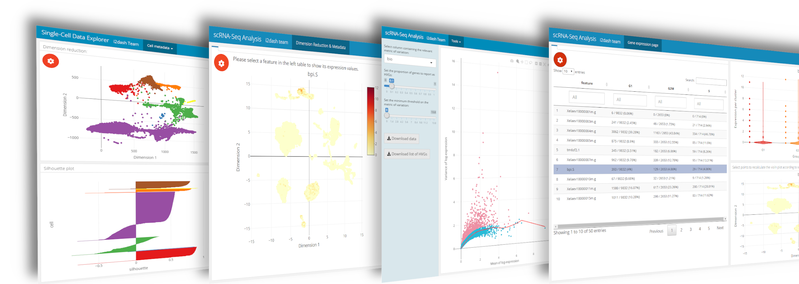

# **i2dash.scRNAseq**: An i2dash extension for single-cell RNA-sequencing data 

## Abstract



The rapid development of NGS technologies enables the investigation of the transcriptome of thousands of cells in a single experiment. single-cell RNA-seq (scRNA-seq) allows to identify rare cell types and populations, to uncover gene regulatory networks, and to track the trajectories of distinct cell lineages in development. The extension **i2dash.scrnaseq** enables an enhanced user interactivity and contains simple but effective tools for the creation of an i2dashboard with focus on scRNA-seq data visualization and exploration. Read further information on the core i2dash package [here](https://loosolab.github.io/i2dash/). 

### Features of **i2dash.scrnaseq**:

- Usage of common single-cell classes "SingleCellExperiment" & "Seurat" for fast creation of components
- Useful and flexible plots with extended interactivity through Shiny widgets
- Pre-defined pages with focus on different aspects of scRNA-seq data
- Linked plots, which recalculate themselfes based on specific selections

### Concept of the extensibility

The ability of i2dash to generate R Markdown code can be extended with additional packages. The figure below demonstrates the concept of extensibility. In order to develop a component or a page with a pre-defined layout and specific composition of components as an extension, the developer needs to provide a method and an R Markdown template. The method takes the i2dashboard object and the data relevant for the component. It validates and stores the data in a suitable data structure in a file (e.g. RDS file). Furthermore the method generates an R Markdown string based on a template for the component or page and extends the i2dashboard object. This package follows the concept of extensibility described in [this i2dash vignette](https://loosolab.github.io/i2dash/articles/i2dash-extension.html). 


## Installation:

```r
# if i2dash is not installed:
installinstall.packages("i2dash")

install.packages("devtools")
devtools::install_github("loosolab/i2dash.scrnaseq", dependencies=c("Depends", "Imports", "LinkingTo"))
```

## Where to start

Based on three common use-cases for single-cell data analysis you can explore the possibilities and features of the **i2dash.scrnaseq** extension. Note: The use-cases show an increasing degree of difficulty and complexity.

### Use-cases:

1. [**Quality metrics**](https://loosolab.github.io/i2dash.scrnaseq/articles/Quality_metrics.html)

   This use-case shows how to build a SingleCellExperiment object from a count-matrix, calculate quality metrics and create a simple dashboard to visualize different quality aspects of an scRNA-seq dataset. [Demo](https://mpibn.paper.ingress.rancher.computational.bio/use-case-1/i2dash/)

2. [**Single-cell data explorer**]((https://loosolab.github.io/i2dash.scrnaseq/articles/sc_data_explorer.html)

   The second use-case demonstrates how to build a dashboard, which enables the exploration of gene expression values and metadata coupled with reduced dimension plots. Mainly native tools and pre-defined pages from the i2dash.scrnaseq package are used. [Demo](https://mpibn.paper.ingress.rancher.computational.bio/use-case-2/i2dash/)

3. [**Visualized parameter selection for experts**]((https://loosolab.github.io/i2dash.scrnaseq/articles/vis_parameter_selection.html)

   The third use-case provides tools of i2dash.scrnaseq, which are useful during the process of data analysis but are not reasonable for the final report. The pre-defined pages enable the selection of features, the inspection of the normalisazion and the selection of optimal paramters for a dimensionality reduction. [Demo](https://mpibn.paper.ingress.rancher.computational.bio/use-case-3/i2dash/)

### Further reading:

- [**Documentation**](https://loosolab.github.io/i2dash.scrnaseq/articles/articles/Documentation.html) This page gives you an overview over all features containing in the **i2dash.scrnaseq** package.

- [**Developer guide**](https://loosolab.github.io/i2dash.scrnaseq/articles/articles/Developer_guide.html) This tutorial explains how to build a customized componentor a pre-defined page from scratch and how to link the components of your page together.


## How to cite
If you use i2dash or i2dash.scrnaseq in your work, please cite:

Ustjanzew A., Preussner J., Bentsen M., Kuenne C., and Looso M. i2dash: creation of flexible, interactive and web-based dashboards for visualization of omics-pipeline results. tba (2020)


## License
This project is licensed under the MIT license.


## Dependencies:
| Visualization  |  Data manipulation | Further  |
|---|---|---|
| ComplexHeatmap    | stringi  | i2dash  |
| plotly            | methods  | magrittr  |
| ggplot2           | rlist  | assertive.sets  |
| shiny             | data.table  | assertive.types  |
| shinyWidgets      | tidyr  | assertive.properties  |
| ComplexHeatmap    | dplyr  | htmltools  |
| knitr             | tibble  |   |
| multipanelfigure  | scran  |   |
| DT                | scater  |   |
| kableExtra        | SingleCellExperiment  |   |
