**Compiled date**: `r Sys.Date()`

**Last edited**: 22.01.2020

**License**: `r packageDescription("i2dash.scrnaseq")[["LICENSE"]]`

```{r style, echo = FALSE, results = 'asis'}
  BiocStyle::markdown()
```

```{r setup, include = FALSE}
knitr::opts_chunk$set(
    collapse = TRUE,
    comment = "#>",
    error = FALSE,
    warning = FALSE,
    message = FALSE
)
stopifnot(requireNamespace("htmltools"))
htmltools::tagList(rmarkdown::html_dependency_font_awesome())
```

```{r global, include=FALSE}
knitr::opts_chunk$set(eval = FALSE)
```

# Introduction 

This documentation presents an overview of the `i2dash.scrnaseq` functionality.
  
The i2dash.scrnaseq R package is an extension for the core i2dash package, which supplies several plotting methods embedded in components and pre-defined pages with linked components. The components provide different shiny based input possibilities (e.g. drop down selection boxes for changing the values plotted along the axes) and enables an enhanced user interactivity. All of the provided functions in the i2dash.scrnaseq package have wrapper for `r BiocStyle::Biocpkg("SingleCellExperiment")` and `r BiocStyle::Biocpkg("Seurat")` objects and enable the direct usage of these objects.


## Setting up the data

Throughout this vignette, we'll use the `AztekinTailData` dataset from the package [scRNAseq](http://bioconductor.org/packages/devel/data/experiment/html/scRNAseq.html) which contains expression values for 13199 cells from Xenopus tail. With the `r BiocStyle::Biocpkg("scater")` package we add some metadata to the SingleCellExperiment object.

```{r allen-dataset}
# Installation of necessary packages:

# if (!requireNamespace("BiocManager", quietly = TRUE))
#     install.packages("BiocManager")
# BiocManager::install(c("scRNAseq", "scater", "scran"))

library(scRNAseq)
library(SingleCellExperiment)
library(scater)
library(scran)

sce <- AztekinTailData()

# Convert some columns to factors
cols <- c("sample", "DevelopmentalStage", "DaysPostAmputation", "cluster", "CellCyclePhase", "Lane", "Condition", "batch")
colData(sce)[cols] <- lapply(colData(sce)[cols], as.factor)

# Normalize the expression values
sce <- logNormCounts(sce, exprs_values="counts")

# Calculating QC metrics
sce <- calculateQCMetrics(sce)
sce <- addPerCellQC(sce)
sce <- addPerFeatureQC(sce)

# Get highly variable genes
gene.var <- modelGeneVar(sce) # the warning message can be ignored
hvg      <- getTopHVGs(gene.var, prop=1000)
```

## Creating an `i2dashboard` object

At first, we create a new `i2dashboard` object[^i2dash]: 

```{r}
library(i2dash)
library(i2dash.scrnaseq)
library(magrittr)

dashboard <- i2dashboard(
  title = "scRNA-Seq Analysis",
  author = "i2dash team",
  interactive = TRUE,
  theme = "yeti",
  datadir = "datadir_doc"
)
```

## Components overview

In the following, the provided componenets from `i2dash.scrnaseq` will be introduced:

### Scatterplot

For demonstration, we add a new page "Scatterplot" with the 2x2 grid layout to the dashboard:

```{r}
dashboard %<>% i2dash::add_page(
    page   = "scatter",
    title  = "Scatterplot",
    layout = "2x2_grid",
    menu   = "Components"
)
```


Now, we add the scatterplot compoenent to the `i2dashboard` object with the `add_component()` function from the `i2dash` package. We specify the type of the component by providing the character string `i2dash.scrnaseq::scatterplot` as the `component` argument. With the `page` parameter we define the page the component is added to. If we do not define a page the component is added to the "default" page of the `i2dashboard` object. 

The further parameters are specific for scatterplot component. As the `object` parameter we provide the `sce` object, from which the required data is extracted. Additionally, we need to specify with the `from` parameter, where the data for the scatterplot is obtained from. In case of a `SingleCellExperiment` object we can choose, wether the columns from "colData", "rowData" or "reducedDim" should be used for mapping on the x- and y-axis as well as for the colour by options. By default all numeric and integer columns are utilized for the x and y-values and all numeric, integer or factorial columns for the colour by option. In the interactive mode the dropdown menues of for the x-, y-axis and colour_by are provided where the user can select the column that should be plotted (the column names are used in the dropdown menu). In the static mode always the first column is used. Furthermore, we can specify the columns that should be mapped. For colouring the scatterplot by feature expression values, we can provide an assay with the parameter `exprs_values`. It should be a character vector containing the column names. Optionally, we can provide our own axis titles with the parameters `x_title` and `y_title`, that do not change according to the selected columns.

```{r, eval=FALSE}
# this component is added to the page "scatter" in the i2dashboard object;
# by default the colData of the object is used for the 'use' parameter;

dashboard %<>% i2dash::add_component(
  component = i2dash.scrnaseq::scatterplot,
  page      = "scatter",
  object    = sce,
  x         = c("total_features_by_counts", "log10_total_features_by_counts"), # specify columns for x and y axis
  y         = c("total_counts", "log10_total_counts"), 
  title     = "Scatterplot of colData" # title of the component
) %>% i2dash::add_component(
  component    = i2dash.scrnaseq::scatterplot,
  page         = "scatter",
  object       = sce,
  from         = "reducedDim",
  use_dimred   = "UMAP",
  exprs_values = "logcounts", # specify the assay for feature expression values
  subset_row   = hvg, # subset the assay to top 1000 hvg's
  title        = "Scatterplot of reducedDim"
)
```

Note: In the static mode no selection options are given, therefore it is required to specify the columns explicitly, which should be used with `x` and `y` parameters.

After assembling the dashboard with the code below, we can inspect the resulting R markdown file by using the "Run Document" button of Shiny inside RStudio.

```{r}
i2dash::assemble(dashboard, exclude = "default")
```

The plot settings of a scatterplot component  |  The scatterplot page after assembly
:-------------------------:|:-------------------------:
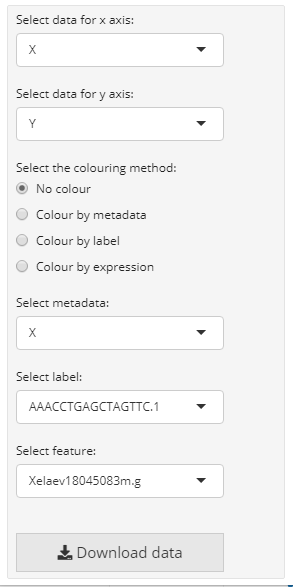  |  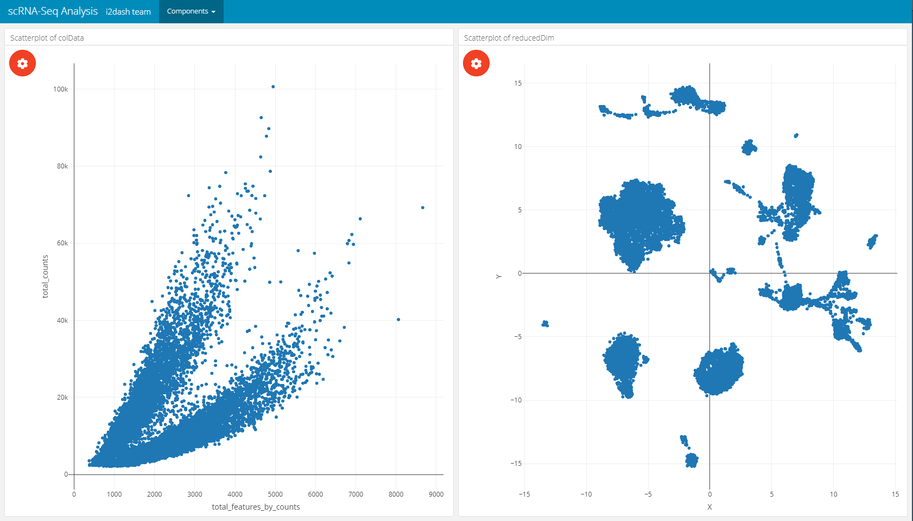


The scatterplot can be coloured by metadata, feature expression or single cell labels:


Coloured by metadata |  Coloured by feature | Coloured by label
:-------------------------:|:-------------------------:|:-------------------------:
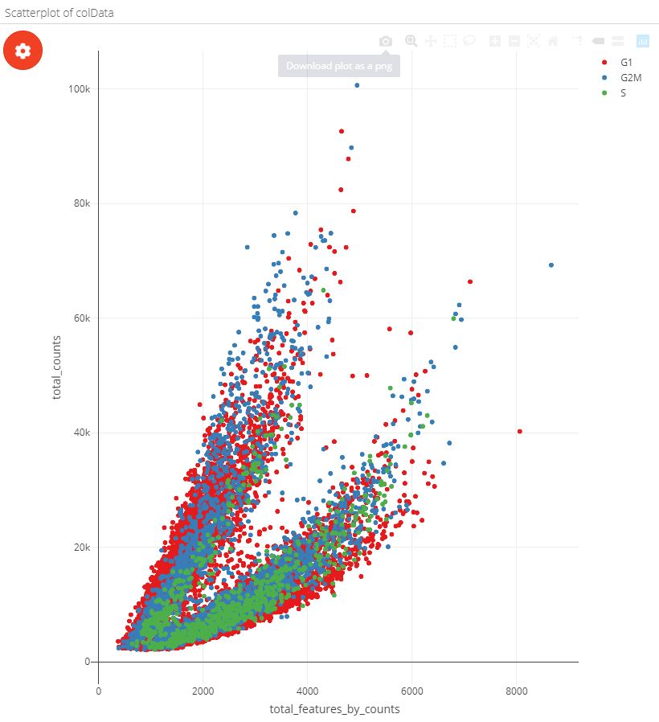  |  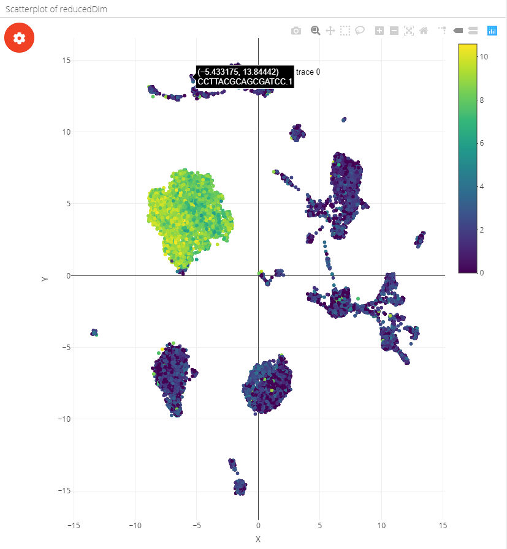  |  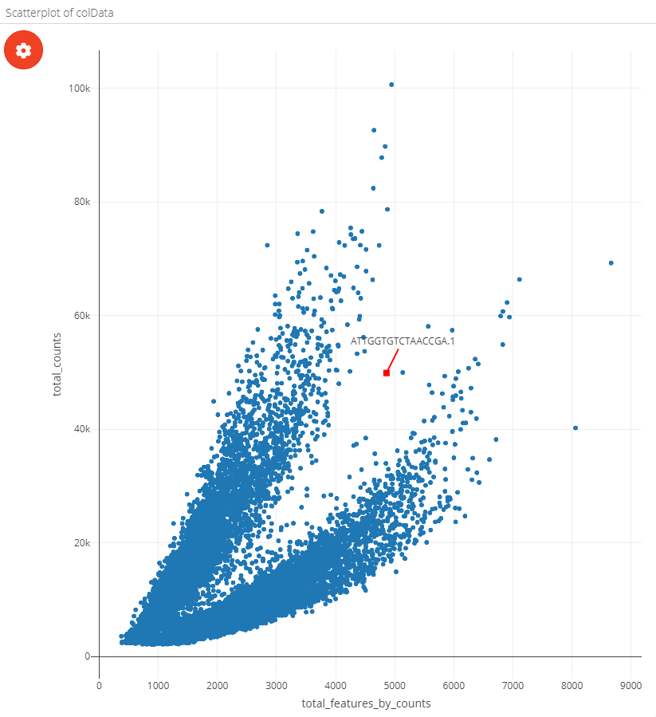

### Violinplot

With `i2dash.scrnaseq::violinplot` a component containing a vertical violinplot is created. The parameter `from` defines where to obtain the data from (either "colData" or "rowData" in case of a SingleCellExperiment object). `y` describes the observations, optionally the observations can be grouped by factors(`group_by` parameter). Therefore, we need to specify the columns containing factors that should be used for grouping the observations along the x-axis. By default all columns with numeric or integer values are used in the dropdown menu of the plot settings in the interactive mode and no columns are used for grouping. Optionally, we can provide our own axis titles with the parameters `group_by_title` and `y_title`, that do not change according to the selected columns.


```{r, eval=FALSE}
# on the left side of the page will be a violinplot without grouping
# on the right side will be a violinplot with grouping
dashboard %<>% i2dash::add_page(page = "violin", title = "Violin plot", layout = "2x2_grid", menu = "Components") %>% i2dash::add_component(
  component = i2dash.scrnaseq::violinplot,
  page      = "violin",
  object    = sce,
  y         = "log10_total_counts",
  from      = "colData",
  title     = "1. Violin plot of colData"
) %>% i2dash::add_component(
  component = i2dash.scrnaseq::violinplot,
  page      = "violin",
  object    = sce,
  from      = "colData",
  group_by  = c("CellCyclePhase","Lane","DaysPostAmputation","Condition"),
  title     = "2. Violin plot of colData"
)
```

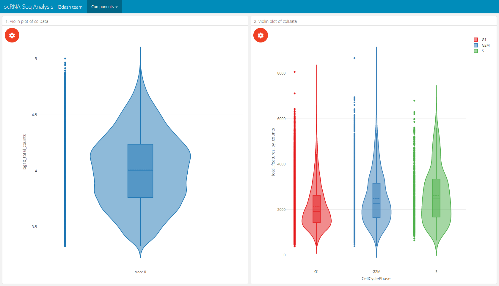

### Boxplot

With `i2dash.scrnaseq::boxplot` a component containing a horizontal boxplot is created. The parameter `from` defines where to obtain the data from ("colData" or "rowData" in case of a SingleCellExperiment object). `x` describes the observations, optionally the observations can be grouped by factors (`group_by` argument).  Therefore, we need to specify the columns containing factors that should be used for grouping the observations along the y-axis. By default all columns with numeric or integer values are used for the "observations" dropdown menu in theplot settings of the interactive mode and no columns are used for grouping if "group_by" is not provided. Optionally, we can provide our own axis titles with the parameters `group_by_title` and `x_title`, that do not change according to the selected columns.

```{r, eval=FALSE}
# on the left side of the page will be a boxplot without grouping
# on the right side will be a boxplot with grouping
dashboard %<>% i2dash::add_page(page = "box", title = "Boxplot", layout = "2x2_grid", menu = "Components") %>% i2dash::add_component(
  component = i2dash.scrnaseq::boxplot,
  page      = "box",
  object    = sce,
  from      = "colData",
  x         = "log10_total_counts",
  title     = "1. boxplot of colData"
) %>% i2dash::add_component(
  component = i2dash.scrnaseq::boxplot,
  page      = "box",
  object    = sce,
  from      = "colData",
  group_by  = c("CellCyclePhase","Lane","DaysPostAmputation","Condition"),
  title     = "2. boxplot of colData"
)
```

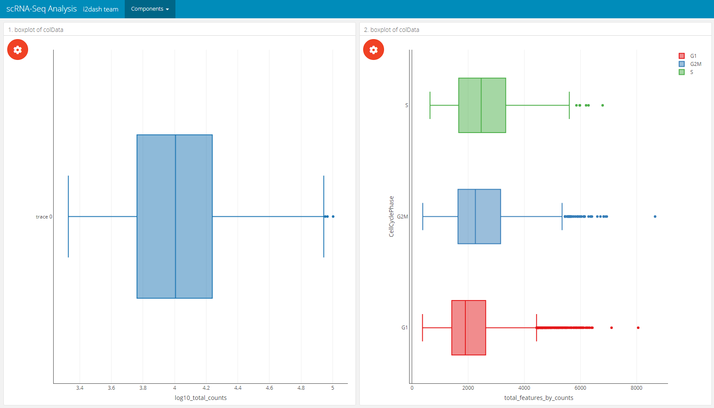

### Barplot

The barplot component created by `i2dash.scrnaseq::barplot` has two possible visualisation options. The first option visualizes a horizontal barplot with the number of observations along the x-axis that are grouped along the y-axis. This option is initiated by only providing the argument `y_group_by`. The second option generates a horizontal barplot with the relative number of observations grouped according to the levels provided by `x_group_by`. This option requires the provision of both parameters `y_group_by` (grouping the observations along the y-axis) and `x_group_by` (grouping the observations along the x-axis). Only columns containing factors are valid for this barplot component. By default, without a character vector with names of columns provided for `y_group_by`, all valid columns are utilized. No columns are used for `x_group_by`, if not provided. Again we need to specify where to obtain the data from with the `use` parameter. Optionally, we can provide our own axis titles with the parameters `y_group_by_title` and `x_group_by_title`, that do not change according to the selected columns.

```{r, eval=FALSE}
# 1. mode: absolute number of observations (left component)
# 2. mode: relative number of observations grouped by 'x_group_by' (right component)
dashboard %<>% i2dash::add_page(page = "bar", title = "Barplot", layout = "2x2_grid", menu = "Components") %>%
i2dash::add_component(
  component = i2dash.scrnaseq::barplot,
  page      = "bar",
  object    = sce,
  from      = "colData",
  title     = "sce barplot: total number of observations",
  x_group_by_title = "Number of cells"
) %>% i2dash::add_component(
  component  = i2dash.scrnaseq::barplot,
  page       = "bar",
  object     = sce,
  y_group_by = c("CellCyclePhase","Lane","DaysPostAmputation","Condition"),
  x_group_by = c("CellCyclePhase","Lane","DaysPostAmputation","Condition"),
  title      = "sce barplot: relative number of observations",
  x_group_by_title = "Fraction of cells"
)
```


### Heatmap

i2dash.scrnaseq provides a component containing a heatmap (`i2dash.scrnaseq::heatmap`) based on the package ComplexHeatmap. In case of the wrapper for the `SingleCellExperiment` and `Seurat` object it is recommended to provide a vector with names of features/ genes of interest (`subset_row`) that match with the row names of the used assay. The assay name is defined by `exprs_values`/ `assay` (by default the "counts" assay of the SingleCellExperiment object is used and the "data" slot of the "RNA" assay of the Seurat object). The rows of the heatmap are the features of interest and columns are the cells. Optionally, we can provide the parameter `split_by`, that should be a character vector containing the column names of "colData" (only columns with factors are valid). This creates a heatmap that is splitted according to the levels of `split_by`. Another parameter enables to visualize a heatmap, where the cells (columns) are aggregated according to the levels inside `aggregate_by` (each level is a column in the heatmap). These visualization options can be interactively adjust in the interactive mode. Also the interactive mode enables the selection of the clustering distance, the clustering method, the options whether to cluster none, only the rows or columns or both. The static mode doesn't offer interactive selection options. Therefore, we can specify several factors with the parameters to be used in the static mode: `split_by`, `aggregate_by` (if you use the static mode and provide both parameters, `aggregate_by` will be preffered against `split_by`), `cluster_rows` (a logical), `cluster_columns` (a logical), `clustering_distance` (a pre-defined character which is one of the follwing: ("euclidean", "maximum", "manhattan", "binary", "minkowski") and `clustering_method` (to perform hierarchical clustering ("average", "ward.D", "ward.D2", "single", "complete", "mcquitty", "median","centroid")).

```{r, eval=FALSE}
dashboard %<>% i2dash::add_page(page = "heatmap", title = "Heatmap", layout = "focal_left", menu = "Components") %>%
i2dash::add_component(# the basic heatmap with cells as columns and features as rows
  component    = i2dash.scrnaseq::heatmap,
  page         = "heatmap",
  object       = sce,
  exprs_values = "logcounts",
  subset_row   = hvg[1:20],
  title        = "Basic heatmap sce"
) %>%
dashboard <- i2dash::add_component(# splitted heatmap
  page         = "heatmap",
  component    = i2dash.scrnaseq::heatmap,
  object       = sce,
  exprs_values = "logcounts",
  subset_row   = hvg[1:20],
  split_by     = c("CellCyclePhase","Lane","DaysPostAmputation","Condition"),
  aggregate_by = c("CellCyclePhase","Lane","DaysPostAmputation","Condition"),
  title        = "Splitted heatmap"
) %>% i2dash::add_component(# aggregated heatmap
  component    = i2dash.scrnaseq::heatmap,
  page         = "heatmap",
  object       = sce,
  exprs_values = "logcounts",
  subset_row   = hvg[1:20],
  aggregate_by = c("CellCyclePhase","Lane","DaysPostAmputation","Condition"),
  title        = "Summarized heatmap"
)
```


The plot settings of a heatmap component  |  The heatmap page after assembly
:-------------------------:|:-------------------------:
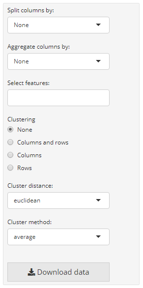  |  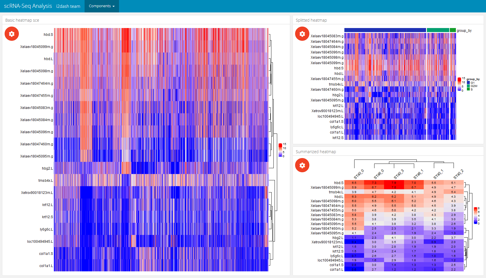

## Pre-defined pages - an overview

### Page of the feature expression

The next page is a pre-defined page in the `i2dash.scrnaseq` package and enables the exploration of gene expression values along the dimension reduction and clustering. This can be very useful e.g. for markergenes to compaire their expression with the clustering. We add and define this page with the [`i2dash.scrnaseq::add_feature_expression_page`](https://loosolab.github.io/i2dash.scrnaseq/reference/feature-expression-page.html) method.

The page is build up on the 2x2 grid layout: 
+ **Table of genes:** The top left component is a table representing the statistic of the number of cells per grouping factor. Each row corresponds to a gene. We define the genes in the table with the parameter `subset_row`. In our example we use the first hundred highly variable genes. We provide several grouping factors with the parameter `group_by`. The grouping factor can be interactively selected. 

+ **Violin plot:** The violin plot is located in the bottom left corner of the page and shows the expression values of the gene selected in the table. The plot is grouped by the selected grouping factor. 

+ **Reduced dimension plot:** On the right side of the page two scatterplots representing the dimension reduction (`use_dimred`) are shown. The upper one is colored by the expression values of the selected gene. The lower one is coloured by the selected grouping factor.

The components are linked together, which means that it is possible to select a row in the table, which represents a gene and the upper scatterplot is coloured by the expression values of the selected gene. Also it is possible to select several points in the scatterplot with the lasso or rectangular tool from plotly. According to the selection the violin plot reacts and is recalculated. This functionality works also in the static mode.

```{r}
dashboard %<>% i2dash.scrnaseq::add_feature_expression_page(
  object       = sce,
  use_dimred   = "UMAP",
  exprs_values = "logcounts",
  group_by     = c("CellCyclePhase","Lane","DaysPostAmputation","Condition"),
  subset_row   = hvg[1:100],
  title        = "Gene explorer"
)

# The warning message: "attributes are not identical across measure variables; they will be dropped" can be ignored.
```

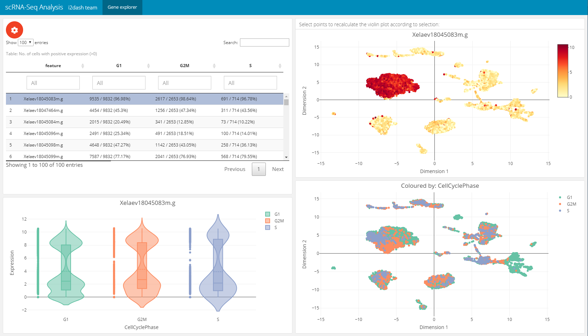 

### Page for dimension reduction and sample metadata analysis

The following page for cell metadata analysis is one of the pre-defined pages in the i2dash.scrnaseq package. We add and define this page with the [`i2dash.scrnaseq::add_dimred_sample_page`](https://loosolab.github.io/i2dash.scrnaseq/reference/dimred-sample-page.html) method. 

This page provides the possibility to inspect the dimension reduction and distribution of cell metadata (e.g. cluster, timepoint, number of genes, etc). The page is build up on the 2x2 grid layout, which means that it may conatain a maximum of four components. The first component is obligatory a dimension reduction plot and the three other component slots are occupied by either box-, bar- or silhouette plots.

+ **Reduced dimension plot:** The data to use for the reduced dimension plot is defined by the parameter `use_dimred`. The plot is coloured by factorial metadata. With the parameter `sample_metadata` we provide a character vector containing the column names of sample metadata stored in the SingleCellExperiment or Seurat object. The parameter `group_by` should be one of the column names from `sample_metadata` and defines the colouring of the scatterplot. In the interactive mode of the dashboard, we can choose from columns of factorial data and colour the scatter plot by this factors. E.g. this is useful when we have processed a clustering on the dimension reduction and provide the name of the metadata column containing the clustering result with `sample_metadata`. 

+ **Bar- / box plots:** As was said, the remaining component slots are occupied by box- or bar plots. The data for these plots is also defined in `sample_metadata`. The data type of the metadata determines whether the component is a bar- or a boxplot. Factorial data results in a barplot: The bars are the levels and the height of the bars represents the number of observation of the level. Numeric data produces a boxplot, which is grouped along the x-axis by the factorial metadata defined with `group_by`. In the interactive mode, the box plot is grouped by the selected data in the dropdown menu. Note, that the colors used for the box plot groups correspond to the colors used in the scatterplot.

+ **Silhouette plot:** Optionally we can define that one of the tree slots is occupied by a silhouette plot. This is done by setting the parameter `show_silhouette` to `TRUE`. The grouping of the silhouette plot is also defined by `group_by` parameter or the selection of the dropdown menu in the interactive mode.

+ **Additional barplot:** Per default, one of the three slots is occupied by a bar plot that shows the number of observations of data defined by `group_by` or the selection of the dropdown menu in the interactive mode. It is possible to prevent this behaviour by setting the parameter `show_group_sizes` to `FALSE`.

A special feature of this page is, that the plots are linked together. This means that it is possible to select several points in the scatter plot of the dimension reduction or bars in the bar-/ silhouette plots  with the lasso or rectangular tool from plotly. according to the selection the other plots are recalculated. This functionality works also in the static mode of the dashboard.

In this example we create two of these pages. Both pages are grouped under the button "Cell metadata" in the navigation bar. The first page contains a dimension reduction, a bar plot of the groups shown in the dimension reduction, a silouette plot and a box plot of the `subsets_Mito_percent` column. Therefore, we provide only two metadata columns in `sample_metadata`. The second page does not contain the silhouette plot or the bar plot of `group_by`, instead we provide three more metadata column names, which will be used in the three free component slots.

```{r}
# Page for metadata exploration with show_group_sizes = TRUE and show_silhouette = TRUE (see left image below) 
dashboard %<>% i2dash.scrnaseq::add_dimred_sample_page(
  object           = sce,
  use_dimred       = "UMAP",
  sample_metadata  = c("cluster","total_features_by_counts"),
  group_by         = "cluster",
  show_group_sizes = TRUE,
  show_silhouette  = TRUE,
  page             = "dimred_sample_page1",
  title            = "Cell metadata 1",
  menu             = "Cell metadata"
)

# Page for metadata exploration with show_group_sizes = FALSE and show_silhouette = FALSE (see right image below) 
dashboard %<>% i2dash.scrnaseq::add_dimred_sample_page(
  object           = sce,
  use_dimred       = "UMAP",
  sample_metadata  = c("CellCyclePhase","cluster","total_counts","Condition"),
  group_by         = "cluster",
  show_group_sizes = FALSE,
  show_silhouette  = FALSE,
  page             = "dimred_sample_page2",
  title            = "Cell metadata 2",
  menu             = "Cell metadata"
)
```

Metadata exploration with `show_group_sizes = TRUE` and `show_silhouette = TRUE`  |  Metadata exploration with `show_group_sizes = FALSE` and `show_silhouette = FALSE`
:-------------------------:|:-------------------------:
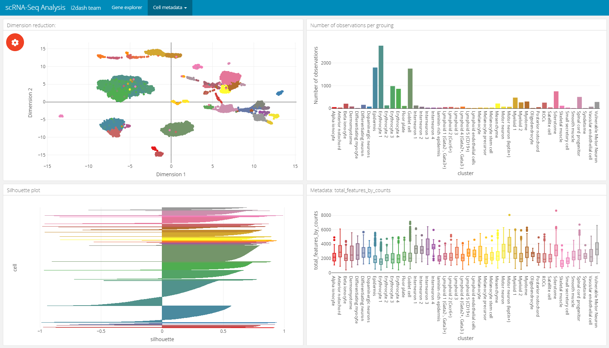  |  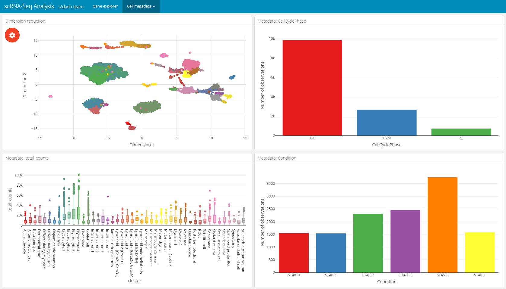

### Page for dimension reduction and feature metadata analysis

This page ([`i2dash.scrnaseq::add_dimred_feature_page`](https://loosolab.github.io/i2dash.scrnaseq/reference/dimred-feature-page.html)) can be used for the exploration of marker genes. The page contains two components, the first component is a scatterplot representing the dimension reduction (`use_dimred`) coloured by the expression values of the selected marker gene (from `exprs_values`). The second component is a table with feature metadata. This additional metadata is obtained from columns of "rowData"/ "feature.data". The rows represent the features. By clicking on a row the feature is selected in the table and the colouring of the scatterplot changes according to its exression values. This linking mechanic is available in the static mode.

```{r, eval=FALSE}
dashboard %<>% i2dash.scrnaseq::add_dimred_feature_page(
  object = sce,
  use_dimred = "UMAP",
  exprs_values = "logcounts",
  feature_metadata = c("mean_counts", "log10_mean_counts", "log10_mean_counts"), # from colnames(rowData(sce))
  subset_row = hvg[1:100], # vector with features of interest
  title = "Dimension Reduction & Metadata"
)
```

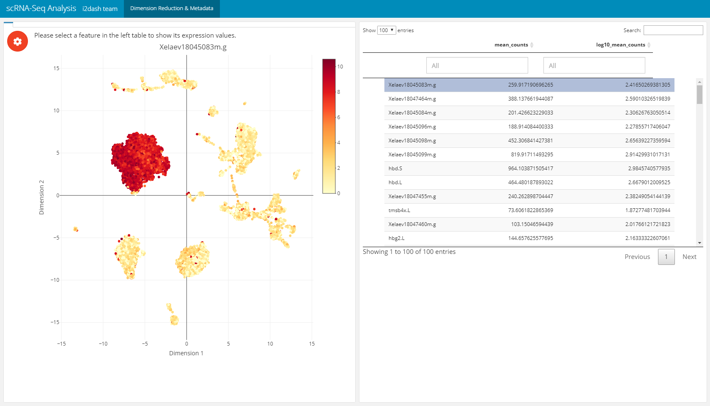

### Feature expression grid page

Another pre-defined page, that is only used in the interactive mode, is the "Feature grid" page of `i2dash.scrnaseq`. The Feature grid page ([`i2dash.scrnaseq::add_feature_grid_page`](https://loosolab.github.io/i2dash.scrnaseq/reference/feature-grid-page.html)) visualizes several feature expressions (obtained from `exprs_values`) along a dimension reduction in a grid layout. The user can select the dimension reduction (defined by the parameter `use_dimred`), the features of interest (`subset_row`) and the grid layout. If `subset_row` is not provided, all features of `exprs_values` are selectible on the page. After that, the user generates the image by clicking on a button. This page enables the user to create high-quality figures for presentations/ publications and define the dimensions of the figure, which is then provided for download.

```{r, eval=FALSE}
dashboard %<>% i2dash.scrnaseq::add_feature_grid_page(
  object = sce,
  use_dimred = "UMAP",
  exprs_values = "counts",
  subset_row = rownames(sce)[1:100], # vector with features of interest
  title = "Multi Gene Expression"
)
```


### Feature selection page

The following pre-defined page can be created by the function [`i2dash.scrnaseq::add_feature_selection_page`](https://loosolab.github.io/i2dash.scrnaseq/reference/feature-selection-page.html) and allows to quantify per-gene variation and the exploration of the threshold on the metric of variation to get the desired set of highly variable genes (hvg). The function creates a page containing a scatter plot of the per-gene variation of log-expression against the mean log-expression and a table with features and their metrics of variation. The sidebar on the left contains Shiny inputs, by which you can color highlight the highly variable genes in dependency to the proportion and minimal threshold of the relevant variation metric. Also you can download the color highlighted hvg or the entire variation metrics table. With the parameter `use_function` we can define the function, which should be used for the quantification of per-gene variation. We can choose one of [scran](http://bioconductor.org/packages/release/bioc/html/scran.html)'s functions ("modelGeneVar", "modelGeneVarByPoisson", "modelGeneCV2", "modelGeneCV2WithSpikes", "modelGeneVarWithSpikes"). Note, that this page only works in the interactive mode with the use of Shiny.

```{r}
# feature selection
dashboard %<>% i2dash.scrnaseq::add_feature_selection_page(
  object       = sce,
  exprs_values = "logcounts",
  use_function = "modelGeneVar",
  menu         = NULL # per default this page would be under the point "Tools" in the navigation bar. With NULL we suppress this behavior.
)
```

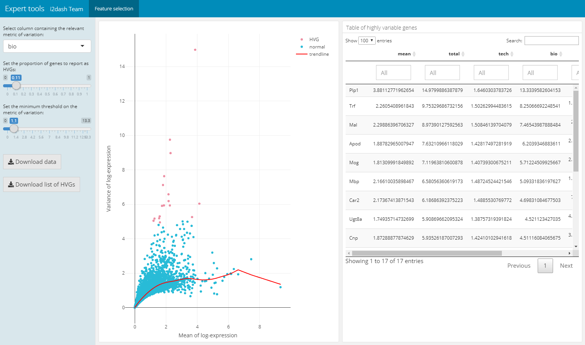

### Parameter selection for dimension reduction methods

For plotting or clustering cells to identify cells with similar transcriptomic profiles of thousands of genes, it is necessery to reduce the number of separate dimensions. i2dash.scrnaseq provides a pre-defined page, which calculates the dimension reduction from count tables and enables the inspection of specific key paramters. This allows the user to compare reduced dimension plots with different values for key parameters and find the optimal values for your dataset. The user can choose interactively between the the non-linear t-stochastic neighbor embedding (t-SNE) merthod or the non-linear uniform manifold approximation and projection (UMAP) method.

t-SNE finds a low-dimensional representation of the data that preserves the distances between each point and its neighbours in the high-dimensional space. With [`i2dash.scrnaseq::add_dimred_comparison_page`](https://loosolab.github.io/i2dash.scrnaseq/reference/dimred-comparison-page.html) we can inspect the “perplexity” parameter that determines the granularity of the visualization as well as the "theta" parameter, that describes the accuracy of optimization. [^dr]

As described in the book "Orchestrating Single-Cell Analysis with Bioconductor" [^book] the UMAP visualization, compaired to t-SNE, tends to have more compact visual clusters with more empty space between them. It also attempts to preserve more of the global structure than t-SNE. From a practical perspective, UMAP is much faster than t-SNE, which may be an important consideration for large datasets. The page allows the verification of the number of neighbours ("n_neighbors"), which has a great effect on the granularity of the output. [^dr]

The page we create with [`i2dash.scrnaseq::add_dimred_comparison_page`](https://loosolab.github.io/i2dash.scrnaseq/reference/dimred-comparison-page.html) has two tabs "Dimension reduction" and "Compare selected plots". By adjusting the parameters in the sidebar and clicking on the "Generate plot" button the scatterplot is generated in the "Dimension reduction" tab. If we want to compare the plot with the specified parameters with other dimension reduction plots, we click the button "Add plot for comparison". The plot is then listed in the table of the sidebar. It is also possible to delete specific plots from the table by clicking the delete button in the row of the plot. In the tab "Compare selected plots" all saved plots are visualized in a grid layout.

```{r}
dashboard %<>% i2dash.scrnaseq::add_dimred_comparison_page(
  object = sce,
  exprs_values = "logcounts",
  seed = 100,
  subset_row = hvg[1:100]
)
```

Tab: "Dimension reduction" |  Tab: "Compare selected plots"  
:-------------------------:|:-------------------------:
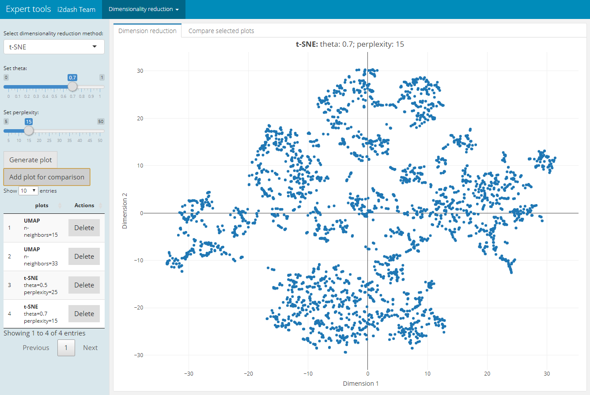  |  


## Usage without single-cell objects

All components and pages can be used without a `SingleCellExperiment` or `Seurat` object. In case of the single-cell object a wrapper function is used, therefore it is possible to provide raw data (e.g. data.frames) to the underlying functions. The following is an example use-case of the core bubbleplot component function. For demonstration purpose we use the `mtcars` `data.frame`.

```{r, eval=FALSE}
# adding the bubbleplot component to the i2dashboard object
dashboard %<>% i2dash::add_component(
  component = i2dash.scrnaseq::bubbleplot,
  x = mtcars[c("mpg", "disp")],
  y = mtcars[c("drat", "wt")],
  size = mtcars[c("hp", "cyl")],
  labels = rownames(mtcars),
  title = "Core function of bubbleplot"
)

assemble(dashboard, file = "docu.Rmd", pages = "default")
```

## Use colormaps

i2dash provides the possibility to use colormaps that are applied document wide. The components and pages of `i2dash.scrnaseq` can handle the user defined colormaps. If the plot has the possibility to colour elements by factors, e.g. the scatterplot component can be coloured by factorial metadata, the colormap is used for the specified metadata column. The name of the colormap shoud be identical with the column name that contatins the factors.

First we define our colormaps:

```{r}
colormap1 <- c("yellow", "red", "black")
colormap1 <- setNames(colormap1, levels(colData(sce)$CellCyclePhase))

colormap2 <- c('#f3cec9', '#e7a4b6', '#cd7eaf', '#a262a9', '#6f4d96', '#3d3b72')
colormap2 <- setNames(colormap2, levels(colData(sce)$Lane))

# it is important, that the name of the colormap is identical with the column in the sce
dashboard <- i2dash::add_colormap(dashboard, map = colormap1, name = "CellCyclePhase") 
dashboard <- i2dash::add_colormap(dashboard, map = colormap2, name = "Lane")
```

Now we create a `2x2_grid` page and add a scatterplot and a boxplot to the page.

```{r}
# add new page
dashboard %<>% i2dash::add_page(page = "color", title = "Colormaps", layout = "2x2_grid") %>%
i2dash::add_component(# add scatterplot to the page
  component = i2dash.scrnaseq::scatterplot,
  page      = "color",
  object    = sce,
  x         = "log10_total_features_by_counts",
  y         = "log10_total_counts", 
  colour_by = "CellCyclePhase",
  title     = "Scatterplot with colormap 1"
) %>% 
i2dash::add_component(# add violinplot to the page
  dashboard = dashboard,
  component = i2dash.scrnaseq::violinplot,
  page      = "color",
  object    = sce,
  from      = "colData",
  y         = "total_counts",
  group_by  = "Lane",
  title     = "Boxplot with colormap 2"
) %>% assemble(file = "docu.Rmd", exclude = "default")
```

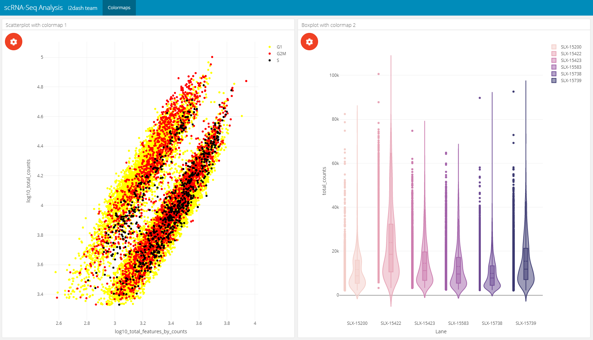 

## Link components together

The linking of several components enables an improvement in the communication of the structure of high-dimensional data. When linking several components, the data of the two visualizations are connected to each other by queries. Thus the interactive manipulation, e.g. selecting data points, of a component is transferred to the associated component. We can either use the native possibility of linking plotly charts as described in the "i2dash-intro" vignette of the `i2dash` package or we can use the linking functionality implemented in `i2dash.scrnaseq`. Note, that the implemented linking mechanics are serer-sided and an interactive shiny-based dashboard is required.

In the following example, a page contains four components. The first component is a scatterplot acting as the transmitter. A transmitter emits the data to the receiver. The remaining three components are a scatterplot, a violinplot and the verbatim-text component, which act as receivers. The transmitter is defined by the parameter `source` that describes a string identifying this component. The parameter `transmitter` defines which component should be used as the transmitter.


```{r}
i2dashboard(interactive=T) %>% i2dash::add_page(
  page = "linking",
  layout = "2x2_grid",
  title = "Linking example"
) %>%
  i2dash::add_component(
    component = i2dash.scrnaseq::scatterplot,
    page      = "linking",
    object    = sce,
    x         = "log10_total_features_by_counts",
    y         = "log10_total_counts",
    colour_by = "CellCyclePhase",
    title     = "Scatterplot transmitter",
    source    = "transmitter"
  ) %>%
  i2dash::add_component(
    component = i2dash.scrnaseq::scatterplot,
    object    = sce,
    title = "Scatterplot receiver",
    page = "linking",
    transmitter = "transmitter"
  ) %>%
  i2dash::add_component(
    component = i2dash.scrnaseq::violinplot,
    object    = sce,
    group_by = "CellCyclePhase",
    y = colnames(colData(sce)),
    title = "Violinplot receiver",
    page = "linking",
    transmitter = "transmitter"
  ) %>%
  i2dash::add_component(
    component = i2dash.scrnaseq::verbatim_text,
    title = "Verbatim_text receiver",
    page = "linking",
    transmitter = "transmitter"
  ) %>% assemble(file = "docu.Rmd", exclude = "default")
```


[^i2dash]: Read more about the core `i2dash` package [here]()
