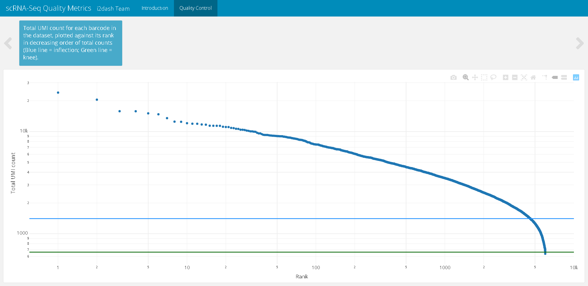
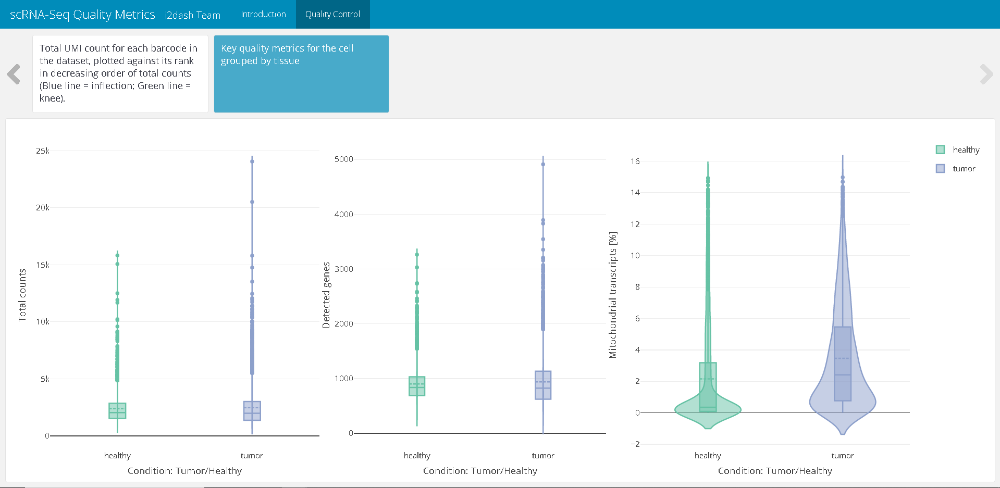
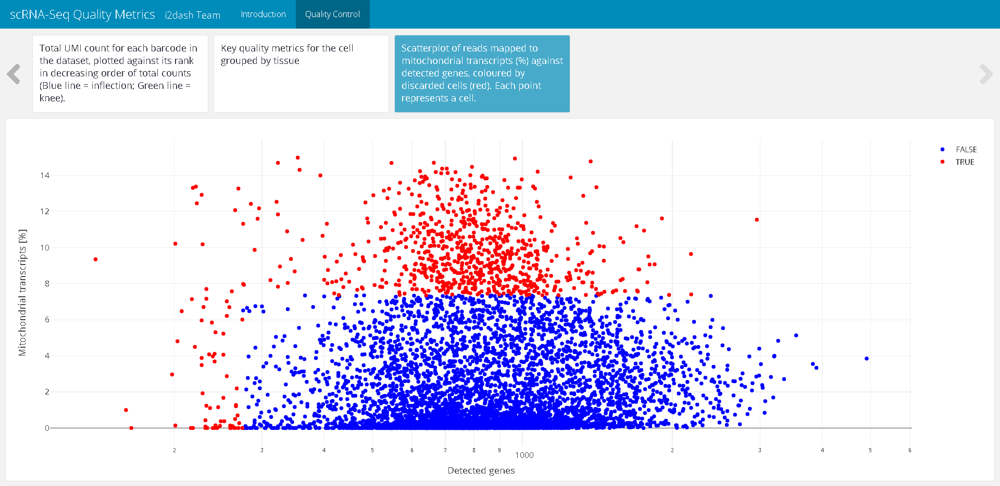
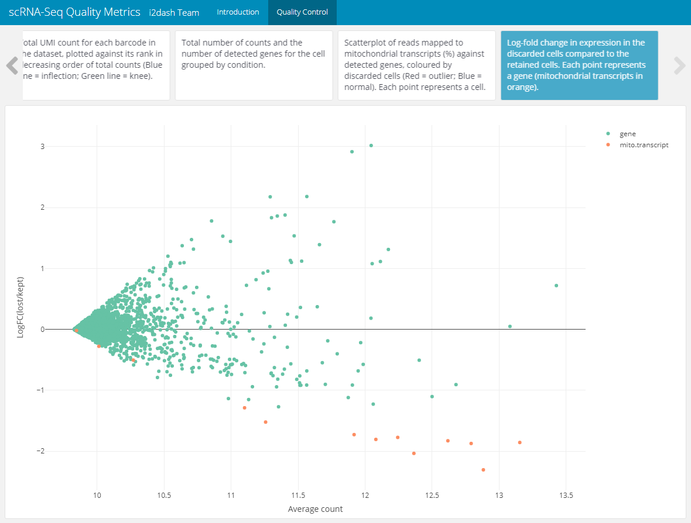
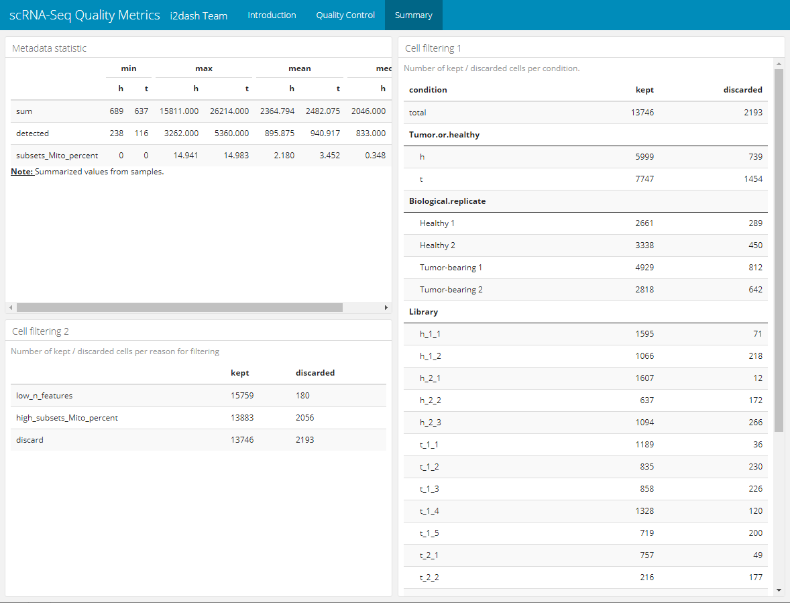

Vignette last complied on `r Sys.Date()`. i2dash is licenced under `r utils::packageDescription("i2dash")[["License"]]`.

```{r style, echo = FALSE, results = 'asis', include = FALSE}
BiocStyle::markdown()
```

```{r setup, include = FALSE}
knitr::opts_chunk$set(
    collapse = TRUE,
    comment = "#>",
    error = FALSE,
    warning = FALSE,
    message = FALSE
)
stopifnot(requireNamespace("htmltools"))
htmltools::tagList(rmarkdown::html_dependency_font_awesome())

library(magrittr)
```

```{r global, include=FALSE}
knitr::opts_chunk$set(eval = FALSE)
```

# Introduction 

The first step in the analysis of single-cell RNA sequencing (scRNA-seq) data is quality control (QC). This step is essential for the further processing of the data and often requires a visual check, in order to effectively eliminate outliers and gain insight into the data set.

The following example demonstrates how to build a `SingleCellExperiment` object from a count-matrix, where each entry represents the expression value of a given feature (rows) in the corresponding cell (column). We demonstrate, how to calculate quality metrics and create an interactive dashboard containing several quality metric plots and statistics. It illustrates the basic functions of the two packages `i2dash` and `i2dash.scrnaseq` and serves as a guide for beginners. You can inspect the demo of the resulting dashboard [here](http://mpibn-mampok.134.176.27.161.xip.io/use-case-1/i2dash/).

# Setting up the data

## Installation

```{r, eval=FALSE}
# Install further necessary packages:
if (!requireNamespace("BiocManager", quietly = TRUE))
    install.packages("BiocManager")
BiocManager::install(c("SingleCellExperiment", "scater", "DropletUtils", "edgeR"))
install.packages(c("Matrix", "magrittr", "plotly", "kableExtra", "dplyr", "tidyr"))
```

Once installed, the packages can be loaded and attached to your current workspace as follows:

```{r}
library(i2dash)
library(i2dash.scrnaseq)
```

## Data preparation

For this use-case the data from Rapolas Zilioni et al. "Single-Cell Transcriptomics of Human and Mouse Lung Cancers Reveals Conserved Myeloid Populations across Individuals and Species" was used [^source]. From the [supplementary files](https://www.ncbi.nlm.nih.gov/geo/query/acc.cgi?acc=GSE127465) we downloaded `GSE127465_mouse_cell_metadata_15939x12.tsv.gz`, `GSE127465_gene_names_mouse_28205.tsv.gz` and `GSE127465_RAW.tar`. The normalized count-matrix was not used, instead we concatenated the raw counts from `GSE127465_RAW.tar` and filtered the features according to the `GSE127465_mouse_counts_normalized_15939x28205.mtx.gz` count-matrix. This step of concatination and filtering is NOT shown in the following, but for those who want to follow this optional part of the tutorial, we have provided the required count-matrix [here](). Further, we start the analysis with loading in the necessary files and building the [`SingleCellExperiment`](https://bioconductor.org/packages/release/bioc/html/SingleCellExperiment.html) [^sce] (see the code below as an example for how to build a `SingleCellExperiment` object from a count-matrix).

**You can skip the following code chunk and simply use the final `SingleCellExperiment` provided by the package [scRNAseq](http://bioconductor.org/packages/devel/data/experiment/html/scRNAseq.html). See [code chunk](#load)**

```{r, collapse=TRUE}
# Load the data: a count matrix, the metadata and the gene names.
# Note: define your current working directory, where the files are located with:
# setwd("path/to/workdir")

library(Matrix)
library(magrittr)
counts   <- read.table("raw_count_mtx.csv",
                       sep = ',',
                       header = TRUE,
                       row.names = 1)

metadata <- read.table("GSE127465_mouse_cell_metadata_15939x12.tsv",
                       sep = '\t',
                       header = TRUE)

features <- read.table("GSE127465_gene_names_mouse_28205.tsv", 
                       sep = "\t", 
                       header = FALSE, 
                       col.names = c("geneID"))

# Set the cell-labels and add row and column names to the counts
cells <- paste0(metadata$Barcode, "_", metadata$Library)

# Assemble metadata into rowData and colData
features %>%
  tibble::column_to_rownames(var = "geneID") -> rowData

colData           <- subset(metadata, select = -c(x, y))
rownames(colData) <- cells
redDim            <- metadata[, c("x", "y")]

# Create the SingleCellExperiment
sce <- SingleCellExperiment(
  assays      = list("counts" = t(counts)), 
  colData     = colData, 
  rowData     = rowData, 
  reducedDims = list("Spring_redDim" = redDim)
)


# Save the object for further analysis 
# (this SingleCellExperiment object will be used in the second use-case)
saveRDS(sce, "GSM3635304_mouse_sce.Rds")

sce
```

<a name="load"></a>

This is the resulting `SingleCellExperiment` containing 28205 genes and 15939 cells:

```{r}
library(SingleCellExperiment)

# Read the SingleCellExperiment
sce_full <- scRNAseq::ZilionisLungData("mouse")
sce_full <- sce_full[, colData(sce_full)$Used==TRUE]
as_factor <- c("Library", "Animal", "Run", "Tissue", "Library prep batch", "Most likely Immgen cell type", "Major cell type", "Minor subset")
colData(sce_full)[as_factor] <- lapply(colData(sce_full)[as_factor], as.factor)

# optional downsampling for better performance
sce <- sce_full[, sample(ncol(sce_full), 6000)]
sce
```

# Calculating quality metrics

Low-quality libraries in scRNA-seq data caused by e.g. cell damage or failure in library preparation manifest as cells with low total counts, few expressed genes and high mitochondrial proportions. To avoid misleading results in downstream analysis it is necessary to remove these cells during the quality control step of the analysis. [^QC]

The quality metrics are computed for each cell with the `perCellQCMetrics()` function from the [scater](https://bioconductor.org/packages/3.10/bioc/html/scater.html) package. The following metrics are important for the further analysis [^perCellQCMetrics]:

- The `sum` column contains the total count for each cell.
- The `detected` column contains the number of detected genes.
- The `subsets_Mito_percent` column contains the percentage of reads mapped to mitochondrial transcripts.

To identify cells that are outliers for the various QC metrics, the function `quickPerCellQC()` from the [scater](https://bioconductor.org/packages/3.10/bioc/html/scater.html) package is used. The calculation  of the metrics is based on the median absolute deviation (MAD) from the median value of each metric across all cells.  `quickPerCellQC()` computes a DataFrame with one row per cell. Each column specifies a reason for why a cell was considered to be low quality, with the final `discard` column indicating whether the cell should be discarded or not[^quickPerCellQC].

```{r}
# Cell-level QC
library(scater)
per.cell     <- perCellQCMetrics(sce, subsets = list(Mito = grep("mt-", rownames(sce))))
colData(sce) <- cbind(colData(sce), per.cell)

# Detect outliers
qc.stats     <- quickPerCellQC(sce, percent_subsets="subsets_Mito_percent")
colData(sce) <- cbind(colData(sce), qc.stats)
```

# Creating an i2dashboard object

At first, we create a new `i2dashboard` object. We provide a title for the dashboard as well as the author. If you are not familiar with the creation of an `i2dashboard` object, you should read the the vignette *"Creating iterative and interactive dashboards with i2dash"* of the `i2dash` package first.

```{r}
# Creating a new i2dashboard class object
dashboard <- i2dashboard(
  title       = "scRNA-Seq Quality Metrics",
  author      = "i2dash Team",
  interactive = FALSE,
  theme       = "yeti",
  datadir     = "datadir_use_case1"
)
```


# Adding the first page to the dashboard

Now, add the first page to the dashboard by using the `add_page()` function. This page will contain a short description of the dataset, which is saved in a separate Markdown file `description.md`. With the `add_component()` function, we add the content of the Markdown file in the form of a component to the first page of the dashboard. In the `i2dash` vignette mentioned above, you can learn more about these two functions.

```{r}
# Creating an introduction page
# Add a component to the introduction page containing the text from "description.md"
dashboard %<>% i2dash::add_page(
  page   = "intro",
  title  = "Introduction",
  layout = "default"
) %>%
  i2dash::add_component(
  component = system.file(package="i2dash.scrnaseq", "data/description.md"),
  page      = "intro"
)
```


# Quality control page

The second page of the dashboard contains several quality metric plots and visualize the key aspects of the quality control step. The storyboard layout is best suited for a sequence of thematically related visualizations. Therefore, we will use it on this page.

```{r}
dashboard <- i2dash::add_page(
  dashboard,
  page   = "qc",
  title  = "Quality Control",
  layout = "storyboard"
)
```

## Check droplet quality

The first step of quality controll is to ensure that our dataset only contains viable cells, e.g. droplets that contain proper mRNA libraries. Therefore, the first plot will be the popular "knee plot", which shows the relationship between the log rank (ordered cells according to the number of distinct UMIs observed) vs. the log total counts (the number of distinct UMIs for each barcode) [^kneeplot].

First, we compute the barcode rank statistics and identify the knee and inflection points with the `barcodeRanks()` function from the [DropletUtils](https://bioconductor.org/packages/release/bioc/html/DropletUtils.html) package. Then, we write a short function to define the horizontal lines according to the identified points. Finally, we plot the data by using the [plotly](https://plot.ly/r/) package.

```{r}
# Plot of Rank / total UMI
library(DropletUtils)
library(plotly)

# Calculate barcode ranks
bcrank <- barcodeRanks(counts(sce))

# Function for horizontal lines
hline <- function(y = 0, color = "blue") {
  list(type = "line", x0 = 0, x1 = 1, xref = "paper", y0 = y, y1 = y, line = list(color = color))
}

# plot the data
droplet <- plot_ly(as.data.frame(bcrank), x = ~rank, y = ~total) %>%
  plotly::layout(
    xaxis = list(type = "log", title = "Rank"),
    yaxis = list(type = "log", title = "Total UMI count"),
    shapes = list(
      hline(metadata(bcrank)$inflection, "darkgreen"),
      hline(metadata(bcrank)$knee, "dodgerblue")
      )
  )
```

The knee plot can now be added with `add_component()` to the quality control page. The `storyboard` layout of this page enables us to compose a longer text, that serves as the title of the component.

```{r}
dashboard <- i2dash::add_component(
  dashboard = dashboard,
  component = droplet,
  page      = "qc",
  title     = "Total UMI count for each barcode in the dataset, plotted against its rank in decreasing order of total counts (Blue line = inflection; Green line = knee)."
)
```

The resulting dashboard page looks like this:

```{r fig-1, fig.cap = "Figure 1: The resulting page with the knee plot after assembly of the dashboard.", eval = TRUE, echo = FALSE}

```

## Plot cell metadata grouped by condition

The next plot enables us to inspect the distributions of QC metrics. With `plotly` we create a plot containing two violin subplots. One subplot shows the total counts per cell, the second plot describes the number of detected genes per cell. In both plots the cells are grouped by the condition "Tumor/Healthy" on the x-axis.

```{r}
p1 <- plot_ly(
  as.data.frame(colData(sce)), 
  x = ~Tissue, 
  y = ~sum, 
  color = ~Tissue, 
  type = "violin", 
  box = list(visible = T), 
  meanline = list(visible = T), 
  legendgroup = ~Tissue
) %>%
  layout(
    xaxis = list(title = "Condition: Tumor/Healthy"),
    yaxis = list(title = "Total counts")
  )
    
p2 <- plot_ly(
  as.data.frame(colData(sce)), 
  x = ~Tissue, 
  y = ~detected, 
  color = ~Tissue, 
  type = "violin", 
  box = list(visible = T), 
  meanline = list(visible = T), 
  legendgroup = ~Tissue,
  showlegend = F
) %>%
  layout(
    xaxis = list(title = "Condition: Tumor/Healthy"),
    yaxis = list(title = "Detected genes")
  )

p3 <- plot_ly(
  as.data.frame(colData(sce)), 
  x = ~Tissue, 
  y = ~subsets_Mito_percent, 
  color = ~Tissue, 
  type = "violin", 
  box = list(visible = T), 
  meanline = list(visible = T), 
  legendgroup = ~Tissue,
  showlegend = F
) %>%
  layout(
    xaxis = list(title = "Condition: Tumor/Healthy"),
    yaxis = list(title = "Mitochondrial transcripts [%]")
  )
    
plot_metadata <- subplot(p1, p2, p3, titleY = TRUE, titleX = TRUE)
```

The new created plot is added to the QC page, exactly as before. We provide a short descriptional sentence as the component title.

```{r}
dashboard %<>% i2dash::add_component(
  component = plot_metadata,
  page      = "qc",
  title     = "Key quality metrics for the cell grouped by tissue"
)
```

```{r fig-2, fig.cap = "Figure 2: The resulting page with the violin plots displaying QC metrics after assembly of the dashboard.", eval = TRUE, echo = FALSE}

```

## Cell filtering

The next tab of the QC page shows a scatterplot containing the number of expressed genes against the percentage of reads mapped to genes in the mitochondrial genome. Each point represents a cell. The plot is coloured by the detected outliers. Well-behaved cells show a large number of expressed genes and a low percentage of mitochondrial expression [^qcplots].

```{r}
cell_filtering <- plot_ly(
  as.data.frame(colData(sce)), 
  x = ~detected, 
  y = ~subsets_Mito_percent, 
  color = ~discard,
  type = "scatter",
  colors = c("TRUE" = "red", "FALSE" = "blue")
) %>%
  layout(
    yaxis = list(title = "Mitochondrial transcripts [%]"),
    xaxis = list(title = "Detected genes", type = "log")
  )
```

As before, we load the `plotly` object into a copmonent and append the component to the QC page.

```{r}
dashboard %<>% i2dash::add_component(
  component = cell_filtering,
  page      = "qc",
  title     = "Scatterplot of reads mapped to mitochondrial transcripts (%) against detected genes, coloured by discarded cells (red). Each point represents a cell."
)
```

```{r fig-3, fig.cap = "Figure 3: The resulting page with the scatterplot representing the cell filtering after assembly of the dashboard.", eval = TRUE, echo = FALSE}

```

## Feature filtering

The last plot allows us to check if an entire cell type is inadvertently discarded by looking for systematic differences in gene expression between the discarded and retained cells. The following code was taken and changed from this source [^discard]. 

```{r}
# check if the discarded pool is enriched for a certain cell type
lost <- scater::calculateAverage(counts(sce)[,!colData(sce)$discard])
kept <- scater::calculateAverage(counts(sce)[,colData(sce)$discard])

# get mitochondrial transcripts
is.mito <- grep("^mt-", rownames(sce))

# compute the logFC and average count
library(edgeR)
logged    <- cpm(cbind(lost, kept), log=TRUE, prior.count=2)
logFC     <- logged[,1] - logged[,2]
abundance <- rowMeans(logged)

# creating a DataFrame containing the data and a column for colouring the genes
df_discarded <- data.frame(abundance = abundance, logFC = logFC)
df_discarded$colour_by <- "gene"
df_discarded$colour_by[is.mito] <- "mito.transcript"
```

The scatterplot shows the log-fold change in expression in the discarded cells compared to the retained cells. Each point represents a gene. Mitochondrial transcripts are colour highlighted. This plot is also appended to the QC page of the dashboard.

```{r}
# Plotting
feature_filtering <- plot_ly(
  df_discarded, 
  x = ~abundance, 
  y = ~logFC,
  color = ~colour_by,
  type = "scatter",
  colors = "Set2",
  text = rownames(df_discarded)
) %>%
  layout(
    xaxis = list(title = "Average count"),
    yaxis = list(title = "LogFC(lost/kept)")
  )

# Add the plot as component to the dashboard
dashboard %<>% i2dash::add_component(
  component = feature_filtering,
  page      = "qc",
  title     = "Log-fold change in expression of the discarded cells compared to the retained cells. Each point represents a gene (mitochondrial transcripts in orange)."
)
```

```{r fig-4, fig.cap = "Figure 4: The resulting page with the scatterplot for checking cell type loss by looking for systematic differences in gene expression between the discarded and retained cell.", eval = TRUE, echo = FALSE}

```

# Summary page

To give the user an overview of the filtered cells and other statistics, we create a new page called "Summary" with a 2x2 grid layout and append it to our dashboard.

```{r}
dashboard %<>% i2dash::add_page(
  page   = "summary",
  title  = "Summary",
  layout = "2x2_grid"
)
```

## 1. summary table

The 2x2 grid layout can hold four components at maximum, which are added columnwise. The first table shows the minimum, maximum, mean and median of the cell metadata. To generate this table the function `summarize_metadata()` from the `i2dash.scrnaseq` package is used. We provide the `SingleCellExperiment` object as input for this function, specify the columns of metadata (colData of the sce) that should be summarized and optionally set a factorial column for grouping the results. Per default this function calculates the four statistics mentioned above, but the author can specify, which functions should be used with the parameter `FUNS`.

```{r}
dashboard <- i2dash::add_component(
  dashboard = dashboard,
  component = i2dash.scrnaseq::summarize_metadata,
  object    = sce,
  from      = "colData",
  columns   = c("sum", "detected", "subsets_Mito_percent"),
  group_by  = "Tissue",
  page      = "summary",
  title     = "Metadata statistic"
)
```

The output is acomponeten containing the following HTML table:

<table class="table table-striped table table-striped" style="margin-left: auto; margin-right: auto; width: auto !important; margin-left: auto; margin-right: auto;">
  <thead>
    <tr>
      <th style="border-bottom:hidden" colspan="1"></th>
      <th style="border-bottom:hidden; padding-bottom:0; padding-left:3px;padding-right:3px;text-align: center; " colspan="2">
        <div style="border-bottom: 1px solid #ddd; padding-bottom: 5px; ">min</div>
      </th>
      <th style="border-bottom:hidden; padding-bottom:0; padding-left:3px;padding-right:3px;text-align: center; " colspan="2">
        <div style="border-bottom: 1px solid #ddd; padding-bottom: 5px; ">max</div>
      </th>
      <th style="border-bottom:hidden; padding-bottom:0; padding-left:3px;padding-right:3px;text-align: center; " colspan="2">
        <div style="border-bottom: 1px solid #ddd; padding-bottom: 5px; ">mean</div>
      </th>
      <th style="border-bottom:hidden; padding-bottom:0; padding-left:3px;padding-right:3px;text-align: center; " colspan="2">
        <div style="border-bottom: 1px solid #ddd; padding-bottom: 5px; ">median</div>
      </th>
    </tr>
    <tr>
      <th style="text-align:left;">   </th>
      <th style="text-align:right;"> h </th>
      <th style="text-align:right;"> t </th>
      <th style="text-align:right;"> h </th>
      <th style="text-align:right;"> t </th>
      <th style="text-align:right;"> h </th>
      <th style="text-align:right;"> t </th>
      <th style="text-align:right;"> h </th>
      <th style="text-align:right;"> t </th>
    </tr>
  </thead>
  <tbody>
    <tr>
      <td style="text-align:left;"> sum </td>
      <td style="text-align:right;"> 689 </td>
      <td style="text-align:right;"> 637 </td>
      <td style="text-align:right;"> 15811.000 </td>
      <td style="text-align:right;"> 26214.000 </td>
      <td style="text-align:right;"> 2364.794 </td>
      <td style="text-align:right;"> 2482.075 </td>
      <td style="text-align:right;"> 2046.000 </td>
      <td style="text-align:right;"> 1979.000 </td>
    </tr>
    <tr>
      <td style="text-align:left;"> detected </td>
      <td style="text-align:right;"> 238 </td>
      <td style="text-align:right;"> 116 </td>
      <td style="text-align:right;"> 3262.000 </td>
      <td style="text-align:right;"> 5360.000 </td>
      <td style="text-align:right;"> 895.875 </td>
      <td style="text-align:right;"> 940.917 </td>
      <td style="text-align:right;"> 833.000 </td>
      <td style="text-align:right;"> 829.000 </td>
    </tr>
    <tr>
      <td style="text-align:left;"> subsets_Mito_percent </td>
      <td style="text-align:right;"> 0 </td>
      <td style="text-align:right;"> 0 </td>
      <td style="text-align:right;"> 14.941 </td>
      <td style="text-align:right;"> 14.983 </td>
      <td style="text-align:right;"> 2.180 </td>
      <td style="text-align:right;"> 3.452 </td>
      <td style="text-align:right;"> 0.348 </td>
      <td style="text-align:right;"> 2.376 </td>
    </tr>
  </tbody>
  <tfoot>
    <tr>
      <td style="padding: 0; border: 0;" colspan="100%">
        <span style="font-weight: bold;text-decoration: underline;">Note: </span> 
        <sup></sup> Summarized values from samples.</td>
    </tr>
  </tfoot>
</table>


## 2. summary table

The second table is a little bit more complicated to create and shows the number of kept and discarded cells, grouped by conditions. For each state of a categorical condition per row the numbers of kept/discarded cells are presented. The final HTML table is created with the package [kableExtra](https://cran.r-project.org/web/packages/kableExtra/vignettes/awesome_table_in_html.html) and looks for the first two conditions as follows:

```{r}
library(kableExtra)
library(dplyr)
library(tidyr)

# Select columns with factorial conditions
factor_columns <- c("Tissue", "Animal", "Library", "Major.cell.type")

# Initialize DataFrame with the total number of kept/discarded cells 
table <- data.frame(condition = "total", "FALSE" = as.numeric(summary(colData(sce)$discard)[2]), "TRUE" = as.numeric(summary(colData(sce)$discard)[3]))
colnames(table) <- c("condition", "FALSE", "TRUE") # column names are changed for further use
rows <- c(1) # a vector to save the rownumber (row per factorial level) of each condition.

# Calculate the number of kept and discarded cells per condition and bind it to the DataFrame
for (column in factor_columns){
  colData(sce) %>%
    as.data.frame() %>%
    group_by(discard, !!! rlang::syms(column)) %>%
    summarise(n_samples = dplyr::n()) %>%
    pivot_wider(names_from = discard, values_from = n_samples) %>%
    rename("condition" = 1) %>%
    as.data.frame() -> stat
  table <- rbind(table, stat)
  rows <- c(rows, nrow(stat))
}

# Change column names
colnames(table) <- c("condition", "kept", "discarded")
end_rows <- cumsum(rows) # get the rownumber indicating the end of a condition

# Create html table with the package kableExtra
summary2 <- kable(table, caption = "Number of kept / discarded cells per condition.") %>%
  kable_styling(bootstrap_options = c("striped", "hover"))
  
# Create groupings in the table by conditions
for (index in 1:length(factor_columns)){
  summary2 %<>%
    pack_rows(factor_columns[index], end_rows[index]+1, end_rows[index+1])
}
```

<table class="table table-striped table-hover" style="margin-left: auto; margin-right: auto;">
  <caption>Number of kept and discarded cells per condition.</caption>
  <thead>
    <tr>
      <th style="text-align:left;"> condition </th>
      <th style="text-align:right;"> kept </th>
      <th style="text-align:right;"> discarded </th>
    </tr>
  </thead>
  <tbody>
    <tr>
      <td style="text-align:left;"> total </td>
      <td style="text-align:right;"> 13746 </td>
      <td style="text-align:right;"> 2193 </td>
    </tr>
    <tr grouplength="2">
      <td colspan="3" style="border-bottom: 1px solid;">
        <strong>Tumor.or.healthy</strong>
      </td>
    </tr>
    <tr>
      <td style="text-align:left; padding-left: 2em;" indentlevel="1"> healthy </td>
      <td style="text-align:right;"> 5999 </td>
      <td style="text-align:right;"> 739 </td>
    </tr>
    <tr>
      <td style="text-align:left; padding-left: 2em;" indentlevel="1"> tumor </td>
      <td style="text-align:right;"> 7747 </td>
      <td style="text-align:right;"> 1454 </td>
    </tr>
    <tr grouplength="4">
      <td colspan="3" style="border-bottom: 1px solid;">
        <strong>Biological.replicate</strong>
      </td>
    </tr>
    <tr>
      <td style="text-align:left; padding-left: 2em;" indentlevel="1"> Healthy 1 </td>
      <td style="text-align:right;"> 2661 </td>
      <td style="text-align:right;"> 289 </td>
    </tr>
    <tr>
      <td style="text-align:left; padding-left: 2em;" indentlevel="1"> Healthy 2 </td>
      <td style="text-align:right;"> 3338 </td>
      <td style="text-align:right;"> 450 </td>
    </tr>
    <tr>
      <td style="text-align:left; padding-left: 2em;" indentlevel="1"> Tumor-bearing 1 </td>
      <td style="text-align:right;"> 4929 </td>
      <td style="text-align:right;"> 812 </td>
    </tr>
    <tr>
      <td style="text-align:left; padding-left: 2em;" indentlevel="1"> Tumor-bearing 2 </td>
      <td style="text-align:right;"> 2818 </td>
      <td style="text-align:right;"> 642 </td>
    </tr>
  </tbody>
</table>

## 3. summary table

The last table summarizes also the number of kept and discarded cells. Each row is a reason for discarding created by the function `perCellQCMetrics()` during the outlier detection step.

```{r}
CellFilterStat <- t(apply(colData(sce)[c("low_n_features", "high_subsets_Mito_percent", "discard")], 2, summary))
colnames(CellFilterStat) <- c("reason", "kept", "discarded")
summary3 <- kable(CellFilterStat[,2:3], caption = "Number of kept / discarded cells per reason for filtering")%>%
  kable_styling(bootstrap_options = c("striped", "hover"))
```

<table class="table table-striped table-hover" style="margin-left: auto; margin-right: auto;">
  <caption>Number of kept/discarded cells per reason for filtering</caption>
  <thead>
    <tr>
      <th style="text-align:left;">   </th>
      <th style="text-align:left;"> kept </th>
      <th style="text-align:left;"> discarded </th>
    </tr>
  </thead>
  <tbody>
    <tr>
      <td style="text-align:left;"> low_n_features </td>
      <td style="text-align:left;"> 15759 </td>
      <td style="text-align:left;"> 180 </td>
    </tr>
    <tr>
      <td style="text-align:left;"> high_subsets_Mito_percent </td>
      <td style="text-align:left;"> 13883 </td>
      <td style="text-align:left;"> 2056 </td>
    </tr>
    <tr>
      <td style="text-align:left;"> discard </td>
      <td style="text-align:left;"> 13746 </td>
      <td style="text-align:left;"> 2193 </td>
    </tr>
  </tbody>
</table>

Finally, we append the last two tables to the Summary page.

```{r}
dashboard %<>% i2dash::add_component(
  component = summary2,
  page      = "summary",
  title     = "Cell filtering 1"
  ) %>% i2dash::add_component(
  component = summary3,
  page      = "summary",
  title     = "Cell filtering 2"
  )
```

```{r fig-5, fig.cap = "Figure 5: The resulting summary page.", eval = TRUE, echo = FALSE}

```

<a name="assemble"></a>

# Assembling the dashboard

The final step is the assembly of the dashboard. During this step an R markdown (Rmd) document is created. This Rmd can be deployed to a Shiny Server to be shared. Alternatively, as the mode of this dashboard is not interactive, the dashboard can be rendered directly into a standalone HTML document with the parameter `render`. Note that an i2dashboard has a "default" page, which is empty and should be excluded from assembling if it was not used. Also it is worth mentioning, that the dashboard can be assembled and inspected after each step of content addition.

```{r}
i2dash::assemble(dashboard, file = "QCDashboard.Rmd", exclude = "default", render = TRUE)
```

[^source]: *Single-Cell Transcriptomics of Human and Mouse Lung Cancers Reveals Conserved Myeloid Populations across Individuals and Species*, Immunity, published: April 09, 2019, Rapolas Zilionis et al. [link](https://www.cell.com/immunity/fulltext/S1074-7613(19)30126-8#%20)

[^sce]: Further information on the SingleCellExperiment class [here](https://osca.bioconductor.org/data-infrastructure.html#prerequisites) and [here](https://bioconductor.org/packages/release/bioc/vignettes/SingleCellExperiment/inst/doc/intro.html)

[^QC]: Further information on quality control [here](https://osca.bioconductor.org/quality-control.html#quality-control-motivation).

[^perCellQCMetrics]: Further information on `perCellQCMetrics()` [here](https://rdrr.io/github/davismcc/scater/man/perCellQCMetrics.html).

[^quickPerCellQC]: Further information on `quickPerCellQC()` [here](https://rdrr.io/github/davismcc/scater/man/quickPerCellQC.html).

[^kneeplot]: Further information on the knee plot [here](https://liorpachter.wordpress.com/tag/knee-plot/)

[^qcplots]: Further information on diagnostic plots [here](https://osca.bioconductor.org/quality-control.html#quality-control-plots)

[^discard]: Further information on cell type loss [here](https://osca.bioconductor.org/quality-control.html#removing-low-quality-cells)
