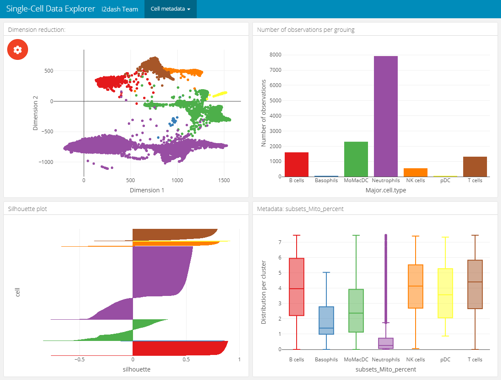
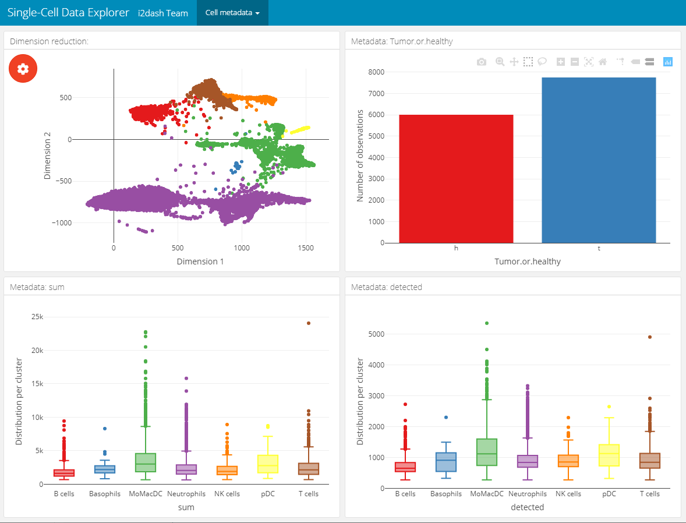
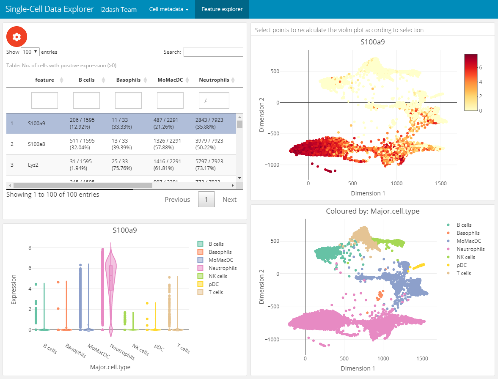
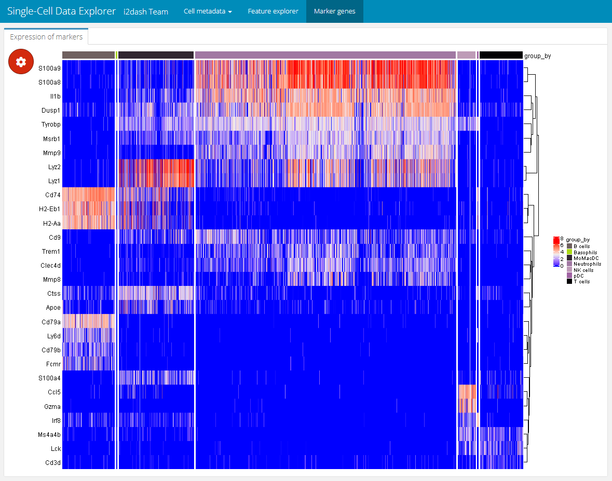
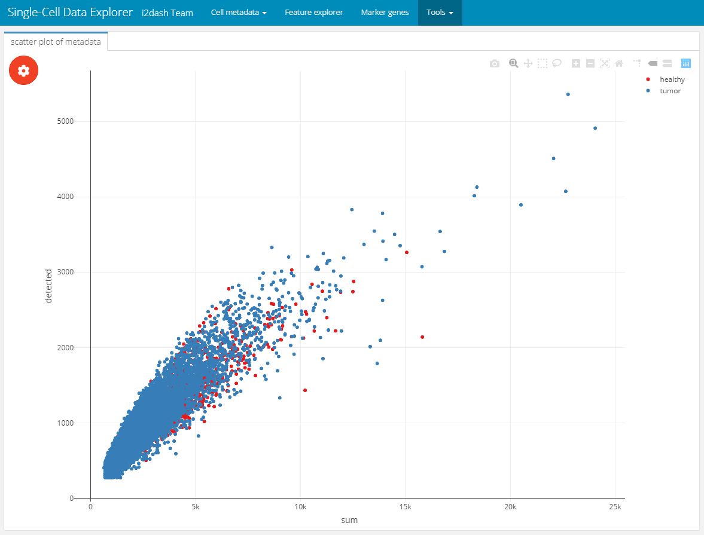
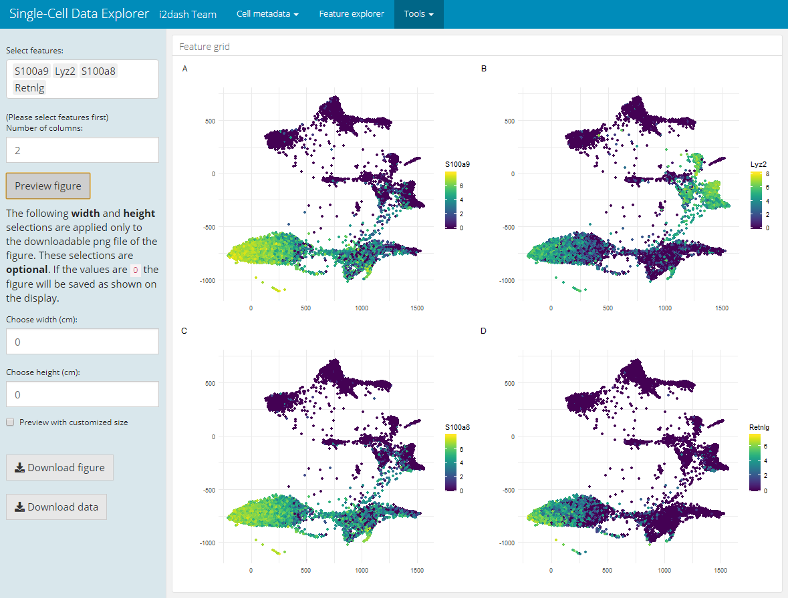

Vignette last complied on `r Sys.Date()`. i2dash is licenced under `r utils::packageDescription("i2dash")[["License"]]`.

```{r style, echo = FALSE, results = 'asis', include = FALSE}
BiocStyle::markdown()
```

```{r setup, include = FALSE}
knitr::opts_chunk$set(
    collapse = TRUE,
    comment = "#>",
    error = FALSE,
    warning = FALSE,
    message = FALSE
)
stopifnot(requireNamespace("htmltools"))
htmltools::tagList(rmarkdown::html_dependency_font_awesome())

library(magrittr)
```

```{r global, include=FALSE}
knitr::opts_chunk$set(eval = FALSE)
```

# Introduction 

In the following example we build a dashboard, which enables the exploration of gene expression values and metadata coupled with low dimensional embedding. Instead of creating local objects and load these in the components, like we did in the [previous use case](Quality_metrics.html), we use mainly native tools and pre-defined pages from the `i2dash.scrnaseq` package. You can inspect the demo of the resulting dashboard [here](http://mpibn-mampok.134.176.27.161.xip.io/use-case-2/i2dash/).

# Data preparation

At first, load the SingleCellExperiment object of the data we used in the first use-case (see [here](docs/articles/Quality_metrics.html#setting-up-the-data)). We subset the sce object according to the identified outliers, perform a log-transformed normalization on the count-matrix and identify the highly variable genes. For these steps, the packages [scater](https://bioconductor.org/packages/3.10/bioc/html/scater.html) and [scran](http://bioconductor.org/packages/release/bioc/html/scran.html) are used. 

```{r}
library(SingleCellExperiment)
library(scater)
library(scran)

# Read the SingleCellExperiment
sce_full <- scRNAseq::ZilionisLungData("mouse")
sce_full <- sce_full[, colData(sce_full)$Used==TRUE]
colnames(sce_full) <- paste0(colnames(sce_full),"_", colData(sce_full)$Library)
as_factor <- c("Library", "Animal", "Run", "Tissue", "Library prep batch", "Most likely Immgen cell type", "Major cell type", "Minor subset")
colData(sce_full)[as_factor] <- lapply(colData(sce_full)[as_factor], as.factor)
colnames(colData(sce_full))[11] <- c("Major.cell.type")

# optional downsampling for better performance
sce <- sce_full[, sample(ncol(sce_full), 6000)]

# Cell-level QC
per.cell     <- perCellQCMetrics(sce, subsets = list(Mito = grep("mt-", rownames(sce))))
colData(sce) <- cbind(colData(sce), per.cell)

# Detect outliers
qc.stats     <- quickPerCellQC(sce, percent_subsets="subsets_Mito_percent")
colData(sce) <- cbind(colData(sce), qc.stats)

# Filtering
sce2         <- sce[,!colData(sce)$discard]
keep_feature <- nexprs(sce, byrow=TRUE) > 0
sce2         <- sce2[keep_feature,]

# Normalization
sce2 <- logNormCounts(sce2)

# Get highly variable genes
gene.var <- modelGeneVar(sce2) # the warning message can be ignored
hvg      <- getTopHVGs(gene.var, prop=0.1)
```


# Creating an i2dashboard object 

Simmilar to the first use-case, we create the `i2dashboard` object. In contrast, the mode of this dashboard is "interactive" (`interactive = TRUE`), which means that the interactivity is increased through Shiny input options. 

```{r}
library(i2dash)
library(i2dash.scrnaseq)

# Creating a new i2dashboard class object
dashboard <- i2dashboard(
  title       = "Single-Cell Data Explorer",
  author      = "i2dash Team",
  interactive = TRUE,
  theme       = "yeti",
  datadir     = "datadir_use_case2"
)
```


# Explorer for cell metadata

The following page for cell metadata analysis is one of the pre-defined pages in the `i2dash.scrnaseq` package. We add and define this page with the function `add_dimred_sample_page()`. 

This page provides the possibility to inspect the dimension reduction and distribution of cell metadata (e.g. cluster, timepoint, number of genes, etc). The page is build up on the 2x2 grid layout, which means that it may conatain a maximum of four components. The first component is obligatory a dimension reduction plot and the three other component slots are occupied by either box-, bar- or silhouette plots.

+ **Reduced dimension plot:** The data to use for the reduced dimension plot is defined by the parameter `use_dimred`. The plot is coloured by factorial metadata. With the parameter `sample_metadata` we provide a character vector containing the column names of sample metadata stored in the SingleCellExperiment or Seurat object. The parameter `group_by` should be one of the column names from `sample_metadata` and defines the colouring of the scatterplot. In the interactive mode of the dashboard, we can choose from columns of factorial data and colour the scatter plot by this factors. E.g. this is useful when we have processed a clustering on the dimension reduction and provide the name of the metadata column containing the clustering result with `sample_metadata`. 

+ **Bar- / box plots:** As was said, the remaining component slots are occupied by box- or bar plots. The data for these plots is also defined in `sample_metadata`. The data type of the metadata determines whether the component is a bar- or a boxplot. Factorial data results in a barplot: The bars are the levels and the height of the bars represents the number of observation of the level. Numeric data produces a boxplot, which is grouped along the x-axis by the factorial metadata defined with `group_by`. In the interactive mode, the box plot is grouped by the selected data in the dropdown menu. Note, that the colors used for the box plot groups correspond to the colors used in the scatterplot.

+ **Silhouette plot:** Optionally we can define that one of the tree slots is occupied by a silhouette plot. This is done by setting the parameter `show_silhouette` to `TRUE`. The grouping of the silhouette plot is also defined by `group_by` parameter and can be changed  in the interactive mode.

+ **Additional barplot:** Per default, one of the three slots is occupied by a bar plot that shows the number of observations of data defined by `group_by` or the selection of the dropdown menu in the interactive mode. It is possible to prevent this behaviour by setting the parameter `show_group_sizes` to `FALSE`.

A special feature of this page is, that the plots are linked together. This means that it is possible to select several points in the scatterplot of the dimension reduction or bars in the bar-/ silhouette plots  with `plotly`'s selection tool. According to the selection the other plots are recalculated. This functionality works also in the static mode of the dashboard.

In this example we create two of these pages. Both pages are grouped under the button "Cell metadata" in the navigation bar. The first page contains a dimension reduction, a bar plot of the groups shown in the dimension reduction, a silhouette plot and a box plot of the `subsets_Mito_percent` column. Therefore, we provide only two metadata columns in `sample_metadata`. The second page does not contain the silhouette plot or the bar plot of `group_by`, instead we provide three more metadata column names, which will be used in the three free component slots.

```{r}
# Page for metadata exploration with show_group_sizes = TRUE and show_silhouette = TRUE (see left image below) 
dashboard %<>% i2dash.scrnaseq::add_dimred_sample_page(
  object           = sce2,
  use_dimred       = "SPRING",
  sample_metadata  = c("Major.cell.type", "subsets_Mito_percent", "Library", "Tissue"),
  group_by         = "Major.cell.type",
  show_group_sizes = TRUE,
  show_silhouette  = TRUE,
  page             = "dimred_sample_page1",
  title            = "Cell metadata 1",
  menu             = "Cell metadata"
)

# Page for metadata exploration with show_group_sizes = FALSE and show_silhouette = FALSE (see right image below) 
dashboard %<>% i2dash.scrnaseq::add_dimred_sample_page(
  object           = sce2,
  use_dimred       = "SPRING",
  sample_metadata  = c("Major.cell.type", "Tissue", "sum", "detected"),
  group_by         = "Major.cell.type",
  show_group_sizes = FALSE,
  show_silhouette  = FALSE,
  page             = "dimred_sample_page2",
  title            = "Cell metadata 2",
  menu             = "Cell metadata"
)
```

Metadata exploration with `show_group_sizes = TRUE` and `show_silhouette = TRUE`  |  Metadata exploration with `show_group_sizes = FALSE` and `show_silhouette = FALSE`
:-------------------------:|:-------------------------:
  |  

# Explorer for gene expression

The next page enables the exploration of gene expression values along the dimension reduction and clustering. This can be very useful e.g. for marker genes to compare their expression with the clustering. We add and define this page with the `add_feature_expression_page()` method.

The page is build up on the 2x2 grid layout: 
+ **Table of genes:** The top left component is a table representing the statistic of the number of cells per grouping factor. Each row corresponds to a gene. We define the genes in the table with the parameter `subset_row`. In our example the first hundred highly variable genes are used. We provide several grouping factors with the parameter `group_by`. The grouping factor can be interactively selected. 

+ **Violin plot:** The violin plot is located in the bottom left corner of the page and shows the expression values of the gene selected in the table. The plot is grouped by the selected grouping factor. 

+ **Reduced dimension plots:** On the right side of the page two scatterplots represent the dimension reduction (`use_dimred`). The upper one is coloured by expression values of the selected gene. The lower one is coloured by the selected grouping factor.

The components are linked together, which means that it is possible to select a row in the table, which represents a gene and the upper scatterplot changes its colouring according to the expression values of the selected gene. The distributions in the violinplot are also recalculated. Further, it is possible to select several points in the scatterplot with `plotly`'s selection tool. According to the selection the violin plot reacts and is recalculated. This functionality works also in the static mode.

```{r}
dashboard %<>% i2dash.scrnaseq::add_feature_expression_page(
  object       = sce2,
  use_dimred   = "SPRING",
  exprs_values = "logcounts",
  group_by     = c("Major.cell.type", "Tissue", "Library"),
  subset_row   = hvg[1:100],
  title        = "Gene explorer"
)

# The warning message: "attributes are not identical across measure variables; they will be dropped" can be ignored.
```

 

# Marker gene detection

The used data set already contains metadata of a clustering. On the previous page we have already used the metadata "Major.cell.type" to colour the clusters of the scatterplot. To interpret these clusters, we need to identify the genes that drive separation between clusters. "These marker genes allow us to assign biological meaning to each cluster based on their functional annotation. In the most obvious case, the marker genes for each cluster are a priori associated with particular cell types, allowing us to treat the clustering as a proxy for cell type identity." [^marker]

We use the `findMarkers()` function from the `scran` package to get a DataFrame for each cluster containing the ranked genes based on the pairwise comparison of their differential gene expression between clusters. The `lapply()` function subsets the first ten marker gene candidates for each cluster. Finally, we get a vector with these unique marker gene candidates. 

```{r}
markers <- findMarkers(sce2, colData(sce2)$Major.cell.type)
marker_list <- lapply(markers, function(x){rownames(x)[1:10]})
marker_names <- unique(unlist(marker_list, recursive = F, use.names = F))
```

The expression values grouped by the clusters can be nicely displayed as a heatmap. Therefore, we add an interactive heatmap to the next page of the dashboard. This component has the advantage of some interactive elements, e.g. the possibility to split or aggregate the heatmap according to a grouping or to cluster the rows and columns. The heatmap visualize each cell as column and the marker genes as rows. The color value corresponds to the expression value of the respective gene. We create the component with the `add_component()` function and provide the function `i2dash.scrnaseq::heatmap` as the `component` parameter. We define the `logcount` assay, which should be used for the expression values of the heatmap. With `subset_row` we subset the assay according to the marker candidates. Further, we provide the possibility to split or group the heatmap according to factorial metadata e.g. "Major.cell.type". We define several metadata columns so that the user can select the grouping interactively.

```{r}
dashboard %<>% i2dash::add_page(
  page   = "marker",
  title  = "Marker genes",
  layout = "default"
) %>% i2dash::add_component(
  page         = "marker",
  component    = i2dash.scrnaseq::heatmap,
  object       = sce2,
  exprs_values = "logcounts",
  subset_row   = marker_names,
  split_by     = c("Major.cell.type", "Tissue", "Library"),
  aggregate_by = c("Major.cell.type", "Tissue", "Library"),
  title        = "Expression of marker genes"
)
```

Interactively, the end-user can select `Major.cell.type` in the "Split columns by" dropdown menu found in the plot settings (the red gear button) and set "Clustering" to `row`. This will produce the heatmap shown below. With this heatmap it is possible to visualize the extression values of the marker genes according to their cluster.  

 

# Tools

In the first use-case, we created objects and used them as input for the `add_component()` function. In this way, we visualized the metadata of the `SingleCellExperiment`. Now we want to use components of `i2dash.scrnaseq`, which allows us to provide an enhanced interactivity for the end-user. With the `i2dash.scrnaseq::scatterplot` component we can easily define several columns of metadata plotted along the axis, so the user can interactively choose the data he is most interested in. 

To create this scatterplot component, the function `i2dash.scrnaseq::scatterplot` is used in the function call of `add_component()`. Then we need to provide further specific parameters required by `i2dash.scrnaseq::scatterplot`. We provide the `sce` object, from which the required data will extracted. Further, we limit the columns the end-user can choose from by providing the parameters `x`, `y` and `colour_by`.

```{r}
dashboard %<>% i2dash::add_page(
  page   = "tools_1",
  title  = "Interactive scatter plot",
  layout = "default",
  menu   = "Tools"
) %>% i2dash::add_component(
  component = i2dash.scrnaseq::scatterplot,
  page      = "tools_1",
  title     = "scatter plot of metadata",
  object    = sce2,
  from      = "colData",
  x         = c("sum", "detected", "subsets_Mito_percent"),
  y         = c("sum", "detected", "subsets_Mito_percent"),
  colour_by = c("Tissue", "Major.cell.type", "Library", "discard")
)
```



Another pre-defined page, that is only used in the interactive mode, is the "Feature grid" page. It visualizes several feature expressions (obtained from `exprs_values`) along a dimension reduction in a grid layout. Interactively, the user can select the dimension reduction (defined by the parameter `use_dimred`), several features of interest (from `subset_row`) and the number of columns of the grid layout. If `subset_row` is not provided, all features of `exprs_values` are selectible on the page. After the user selceted the features, the image will be generated by clicking on the button "Generate plot". This page enables the user to create and download high-quality figures with user-defined dimensions for presentations/ publications.

```{r}
dashboard %<>% i2dash.scrnaseq::add_feature_grid_page(
  object       = sce2,
  use_dimred   = "SPRING",
  exprs_values = "logcounts",
  subset_row   = hvg[1:100]
)
``` 

 

# Assembling the dashboard

The final step is the assembly of the dashboard. During this step an R markdown (Rmd) document is created. This Rmd file needs to be deployed to a Shiny Server. You can use the i2dash docker container available [here](https://gitlab.gwdg.de/loosolab/container/i2dash.deployment) to create a local Shiny server. Alternatively, you can view the dashboard by clicking the "Run Document" button in RStudio IDE.

```{r}
i2dash::assemble(dashboard, file = "scDataExplorer.Rmd", exclude = "default")
```

[^marker]: ["Marker gene detection"](https://osca.bioconductor.org/marker-detection.html)
